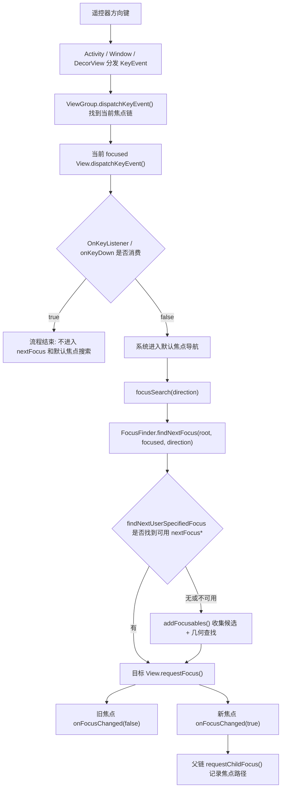

### Android TV 焦点下发源码流程

###### 内容概述

本文件整理 Android TV 焦点从“请求”“搜索”“候选收集”“焦点确认”到“父链记录”的源码级流程。TV 焦点不是单个 `requestFocus()` 就能解释清楚的问题，而是一套由 `View`、`ViewGroup`、`FocusFinder`、`RecyclerView` 和 `RecyclerView.LayoutManager` 共同参与的链路。

核心关注点：

- `View.requestFocus()`：目标 View 主动申请成为当前焦点。
- `ViewGroup.requestFocus()`：父容器决定自己拿焦点，还是把焦点下发给子 View。
- `onRequestFocusInDescendants()`：焦点进入容器时，容器选择哪个子 View 优先拿焦点。
- `focusSearch()`：已有焦点后，根据方向键寻找下一个焦点。
- `FocusFinder.findNextFocus()`：从候选 View 中按几何规则找最合适的目标。
- `addFocusables()`：把可聚焦 View 加入候选集合。
- `requestChildFocus()`：子 View 成功拿到焦点后，父容器沿父链记录焦点路径。

###### 使用场景

- 页面首次进入时，下发默认焦点到第一个可操作控件。
- 用户按遥控器方向键时，从当前焦点移动到下一个焦点。
- 某个 `ViewGroup` 获得焦点机会时，把焦点交给内部更合理的子 View。
- RecyclerView 刷新、复用、滚动后，当前 item 焦点丢失或落错。
- 弹窗关闭、页面返回、播放器控制层隐藏后，恢复到之前的焦点位置。

一级栏目导航：

- [源码角色总览](#源码角色总览)
- [焦点下发从哪里开始](#焦点下发从哪里开始)
- [主动请求焦点 requestFocus 流程](#主动请求焦点-requestfocus-流程)
- [ViewGroup requestFocus 和 descendantFocusability](#viewgroup-requestfocus-和-descendantfocusability)
- [onRequestFocusInDescendants](#onrequestfocusindescendants)
- [方向键移动 focusSearch 流程](#方向键移动-focussearch-流程)
- [KeyEvent nextFocus 和 OnKeyListener 时机](#keyevent-nextfocus-和-onkeylistener-时机)
- [FocusFinder 几何查找](#focusfinder-几何查找)
- [addFocusables 候选收集](#addfocusables-候选收集)
- [requestChildFocus 父链记录](#requestchildfocus-父链记录)
- [一次完整方向键流程](#一次完整方向键流程)
- [RecyclerView 下的特殊流程](#recyclerview-下的特殊流程)
- [Activity Fragment 和 ViewGroup 的焦点边界](#activity-fragment-和-viewgroup-的焦点边界)
- [页面返回后的焦点恢复](#页面返回后的焦点恢复)
- [TV 工程实践规范](#tv-工程实践规范)
- [调试方法](#调试方法)
- [面试可能怎么问](#面试可能怎么问)

<a id="源码角色总览"></a>
###### 源码角色总览

| 角色 | 主要职责 | TV 场景里的关注点 |
|---|---|---|
| `View` | 判断自己是否可聚焦，并真正成为 focused view | item 根布局、按钮、Tab、播放器控制按钮是否满足可聚焦条件 |
| `ViewGroup` | 管理子 View，决定焦点是否下发到 descendants | 页面根布局、行容器、弹窗容器、控制层容器的焦点优先级 |
| `FocusFinder` | 根据方向和候选 View 的矩形位置选出下一个焦点 | 为什么按右键没有去“看起来最近”的卡片 |
| `addFocusables()` | 收集当前范围内可成为候选焦点的 View | 某个 View 没进入候选集，后面就不可能被选中 |
| `requestChildFocus()` | 子 View 拿到焦点后，通知父容器记录焦点路径 | 自定义容器保存最后焦点、恢复行内焦点 |
| `RecyclerView` | 动态创建、复用、回收 item，并参与焦点搜索 | item 不一定存在，焦点恢复要等数据和 attach |
| `RecyclerView.LayoutManager` | 决定 item 布局、滚动和部分焦点搜索行为 | TV 列表按方向键时是否滚动、是否能找到屏幕外 item |

可以先把焦点系统理解成两条主线：

- 主动下发焦点：页面或业务代码明确调用 `target.requestFocus()`。
- 方向搜索焦点：用户按方向键，系统从当前焦点出发找下一个目标，然后对目标调用 `requestFocus()`。

两条主线最后都会落到同一个结果：某个 View 成功拿到焦点，旧焦点失去焦点，父容器链路更新自己的 focused child 记录。

<a id="焦点下发从哪里开始"></a>
###### 焦点下发从哪里开始

先给结论：焦点下发不是从 `onRequestFocusInDescendants()` 开始，也不是从 `FocusFinder` 开始。它的入口通常来自“业务主动请求”“系统按键导航”“窗口/页面恢复时的系统兜底”这几类场景，最后才会进入 `View.requestFocus()` 或 `ViewGroup.requestFocus()`。

常见入口可以分成四类：

| 入口 | 谁触发 | 典型代码或事件 | 后续会走到哪里 |
|---|---|---|---|
| 页面首次默认焦点 | 业务代码 | `target.post { target.requestFocus() }` | `View.requestFocus()` / `ViewGroup.requestFocus()` |
| 返回页或刷新后恢复焦点 | 业务代码 | `submitList { restoreFocusById() }` | 找到目标 View 后调用 `requestFocus()` |
| 遥控器方向键移动 | 系统按键分发 | `DPAD_LEFT/RIGHT/UP/DOWN` 没被消费 | `focusSearch()` -> `nextFocus*` / `FocusFinder` -> `requestFocus()` |
| 窗口获得焦点或系统兜底 | ViewRoot / DecorView / 根布局 | 页面 attach、Window focus 变化、当前焦点失效 | 根 View 或某个 `ViewGroup` 尝试找默认可聚焦目标 |

Activity 首次进入时，焦点来源要拆成“窗口焦点”和“View 焦点”两层：

- Activity 被启动后，`ActivityThread` 调用 Activity 生命周期。
- `setContentView()` 把页面布局安装到 `PhoneWindow` 的 `DecorView` 下面。
- Activity resume 后，Window 被加入 `WindowManager`，系统为这棵 View 树创建 `ViewRootImpl`。
- `ViewRootImpl` 负责和窗口系统交互，并驱动 measure / layout / draw / input。
- 当 Window 获得焦点、View 树 attach 且第一次 traversals 过程中，DecorView / 根 View 才会尝试让 View 树里出现一个当前 focused view。
- 这个初始 View 焦点可能来自 XML 默认可聚焦控件、根布局的默认搜索、`ViewGroup` 的 `descendantFocusability` / `onRequestFocusInDescendants()`，也可能被业务后续的 `requestFocus()` 覆盖。

所以“Activity 获取的焦点是哪来的”要区分：

| 名称 | 来源 | 说明 |
|---|---|---|
| Window 焦点 | 系统窗口管理 | 表示这个 Activity 的 Window 当前接收输入事件 |
| View 焦点 | DecorView 下面的 View 树 | 表示遥控器/键盘事件最终面向哪个具体 View |

Activity 本身不是那个被方向键操作的 focused view。真正的焦点通常可以通过下面方式看到：

```kotlin
val current = window.decorView.findFocus()
Log.d("TvFocus", "current=$current")
```

如果你没有主动调用 `requestFocus()`，系统会在 View 树 ready 后尝试找一个默认可聚焦目标。这个目标不一定符合 TV 业务预期，尤其是页面有 RecyclerView、加载态、弹窗、多个可聚焦按钮时。因此 TV 页面通常要在合适时机主动下发默认焦点：

```kotlin
binding.root.post {
    binding.firstCard.requestFocus()
}
```

页面首次进入时，最常见的入口是业务代码主动下发：

```kotlin
override fun onViewCreated(view: View, savedInstanceState: Bundle?) {
    binding.firstCard.post {
        binding.firstCard.requestFocus()
    }
}
```

这个入口的实际链路是：

```text
Fragment / Activity 渲染页面
  -> 等 View attach、布局或数据提交完成
  -> 业务代码调用 target.requestFocus()
  -> 如果 target 是普通 View，检查自己能否聚焦
  -> 如果 target 是 ViewGroup，按 descendantFocusability 决定是否下发给 child
  -> child 成功拿焦点后，父链 requestChildFocus()
```

遥控器方向键不是直接“下发焦点”，而是先“搜索下一个焦点”，搜索到目标后才对目标执行 `requestFocus()`：

```text
用户按方向键
  -> KeyEvent 分发到当前 focused View
  -> 如果没人消费，系统进入默认焦点导航
  -> focusSearch(direction) 找目标
  -> nextFocus* 或 FocusFinder 选出目标
  -> 目标 View.requestFocus()
```

窗口或页面恢复时也可能出现系统兜底逻辑。例如当前焦点 View 被移除、页面重新 attach、DecorView 重新获得窗口焦点时，系统会尽量让 View 树里存在一个合理焦点。但 TV 工程里不要依赖这个兜底，因为它只知道 View 树和几何位置，不知道“用户上次看的是哪个业务 item”。列表页仍然应该保存业务 id，并在数据恢复后主动 `requestFocus()`。

所以排查“焦点从哪里下发”的第一步不是看 `FocusFinder`，而是先确定入口：

- 是页面初始化代码主动 `requestFocus()`？
- 是 Activity Window 首次获得焦点后，DecorView / 根 View 的系统默认焦点？
- 是返回/刷新后恢复逻辑主动 `requestFocus()`？
- 是方向键没有被消费后触发的默认焦点搜索？
- 是弹窗关闭、控制层显示隐藏、Window focus 变化后的兜底？

入口确定后，再沿着对应链路继续看 `requestFocus()`、`onRequestFocusInDescendants()`、`focusSearch()`、`nextFocus*`、`addFocusables()` 和 `requestChildFocus()`。

<a id="主动请求焦点-requestfocus-流程"></a>
###### 主动请求焦点 requestFocus 流程

`requestFocus()` 的含义是“我希望这个 View 成为焦点”，不是“强制这个 View 一定成为焦点”。它会经过一系列条件检查，任何一个关键条件不满足都可能返回 `false`。

常见检查条件：

- View 本身 `focusable=true`。
- View 可见，通常要满足 `isShown()`。
- View 可用，不能是 `enabled=false`。
- View 已经进入窗口或即将能被窗口管理；TV 列表中尤其要注意 item 是否已经 attach。
- 当前触摸模式是否允许该 View 聚焦，`focusableInTouchMode` 不应该在 TV 场景滥用。
- 父容器没有通过 `FOCUS_BLOCK_DESCENDANTS` 阻止子 View 聚焦。
- 如果 View 已经有焦点，重复请求通常不会产生新的焦点变化。

简化伪代码可以理解为：

```java
boolean requestFocus(int direction, Rect previouslyFocusedRect) {
    if (!canTakeFocus()) {
        return false;
    }

    if (isViewGroup()) {
        // ViewGroup 可能先把焦点交给 child。
        if (tryFocusDescendantByPolicy(direction, previouslyFocusedRect)) {
            return true;
        }
    }

    handleFocusGainInternal(direction, previouslyFocusedRect);
    return true;
}
```

更贴近日常排查的链路是：

```text
业务代码调用 target.requestFocus()
  -> target 检查自己是否可获得焦点
  -> 如果 target 是 ViewGroup，按 descendantFocusability 决定是否先尝试 child
  -> 目标 View 成功获得焦点
  -> 旧焦点 clearFocus
  -> 新焦点触发 onFocusChanged(true)
  -> 父容器链路触发 requestChildFocus
```

`requestFocus()` 失败时，不要只看调用代码，要沿着下面几个问题排查：

| 问题 | 典型原因 | 处理方式 |
|---|---|---|
| 目标 View 不可见 | `GONE`、`INVISIBLE`、父布局不可见 | 等状态切换后再请求 |
| 目标 View 不可聚焦 | XML 没设 `focusable`，或代码里被改成 false | 明确设置 item 根布局或按钮可聚焦 |
| item 还不存在 | RecyclerView 数据未提交，ViewHolder 未创建 | `submitList` 回调后再恢复，必要时监听 attach |
| 父容器阻止子焦点 | `descendantFocusability=blocksDescendants` | 检查父容器策略 |
| 请求时机太早 | `onCreateView` 后数据和布局还没完成 | 用 `post`、`doOnLayout`、attach 回调延后 |
| 焦点被抢走 | 多处同时 `requestFocus()` | 默认焦点只下发一次，恢复焦点加状态门禁 |

TV 页面里常见的默认焦点请求方式：

```kotlin
fun View?.requestFocusIfReady(): Boolean {
    val target = this ?: return false
    if (!target.isShown || !target.isEnabled || !target.isFocusable || !target.isAttachedToWindow) {
        return false
    }
    return target.requestFocus()
}
```

注意：这个方法只能减少低级错误，不能解决 RecyclerView item 未创建的问题。列表场景还要配合数据提交、滚动、attach 监听。

<a id="viewgroup-requestfocus-和-descendantfocusability"></a>
###### ViewGroup requestFocus 和 descendantFocusability

`ViewGroup` 自己也是 `View`，所以它也可以被 `requestFocus()`。区别在于，`ViewGroup` 里面还有子 View，它要决定焦点优先给自己，还是给子 View。

这个决策主要受 `descendantFocusability` 影响：

| 策略 | 含义 | 适用场景 | 风险 |
|---|---|---|---|
| `beforeDescendants` | 父容器先尝试自己拿焦点，失败后再尝试子 View | 父容器本身就是一个可操作整体 | 子 View 可能不容易优先拿到焦点 |
| `afterDescendants` | 子 View 优先，子 View 都失败后父容器兜底 | 页面区域、列表行容器、普通内容容器 | 只能改变优先级，不能恢复已丢失焦点 |
| `blocksDescendants` | 父容器阻止子 View 获取焦点 | loading、遮罩、纯展示区域、禁用区域 | 误用会导致内部按钮和 item 完全无法聚焦 |

简化流程：

```java
boolean ViewGroup.requestFocus(direction, rect) {
    if (descendantFocusability == FOCUS_BLOCK_DESCENDANTS) {
        return requestFocusForSelf(direction, rect);
    }

    if (descendantFocusability == FOCUS_BEFORE_DESCENDANTS) {
        if (requestFocusForSelf(direction, rect)) return true;
        return onRequestFocusInDescendants(direction, rect);
    }

    if (descendantFocusability == FOCUS_AFTER_DESCENDANTS) {
        if (onRequestFocusInDescendants(direction, rect)) return true;
        return requestFocusForSelf(direction, rect);
    }
}
```

这里最容易踩坑的是 `afterDescendants`。它只表示“父容器获得焦点机会时，优先让子 View 拿焦点”，但它不保存 RecyclerView 刷新前的 item 身份，也不会等待 item 重新 attach，更不会在原 View 被回收后自动找回业务上同一个 item。

所以这种问题不能只靠 XML 解决：

```xml
android:descendantFocusability="afterDescendants"
```

它能解决的是“父容器和子 View 谁优先拿焦点”，不能解决“刷新后原来的焦点 View 不存在了，应该按业务 id 恢复到哪个 item”。

<a id="onrequestfocusindescendants"></a>
###### onRequestFocusInDescendants

`onRequestFocusInDescendants()` 是 `ViewGroup` 的扩展点，含义是：当焦点要进入这个容器时，容器尝试让内部某个子 View 获得焦点。

它通常出现在这些场景：

- 页面根容器或某个区域被调用 `requestFocus()`。
- `ViewGroup` 的 `descendantFocusability` 是 `afterDescendants` 或父容器尝试把焦点下发给 child。
- 页面返回后，一个区域重新获得焦点机会。
- 弹窗、控制层、侧边栏显示后，希望焦点落到内部默认按钮。

默认逻辑可以理解为遍历子 View：

```java
protected boolean onRequestFocusInDescendants(int direction, Rect previouslyFocusedRect) {
    for (child in childrenByFocusOrder(direction)) {
        if (child.isVisible() && child.requestFocus(direction, previouslyFocusedRect)) {
            return true;
        }
    }
    return false;
}
```

它的关键点不是“搜索下一个方向焦点”，而是“焦点进入容器时，容器内部谁优先”。这和 `focusSearch()` 不一样。

TV 常见 override 场景：

```kotlin
class TvHomeRowLayout @JvmOverloads constructor(
    context: Context,
    attrs: AttributeSet? = null
) : LinearLayout(context, attrs) {

    var preferredFocus: View? = null

    override fun onRequestFocusInDescendants(
        direction: Int,
        previouslyFocusedRect: Rect?
    ): Boolean {
        val target = preferredFocus
        if (target != null && target.isShown && target.isFocusable && target.requestFocus()) {
            return true
        }
        return super.onRequestFocusInDescendants(direction, previouslyFocusedRect)
    }
}
```

适合在这里做的事：

- 频道页进入时，优先聚焦当前选中的 Tab。
- 首页某一行重新获得焦点时，优先聚焦这一行上次停留的卡片。
- 播放器控制层显示时，优先聚焦播放/暂停按钮。
- 空页面或错误页显示时，优先聚焦重试按钮。

不适合在这里做的事：

- 不看状态，每次都强行聚焦第一个 child。
- 在 RecyclerView item 还没创建时直接请求某个 position。
- 把方向键移动逻辑全塞到这里。方向键已有当前焦点时，更应该看 `focusSearch()` 或 `RecyclerView.LayoutManager`。

<a id="方向键移动-focussearch-流程"></a>
###### 方向键移动 focusSearch 流程

`focusSearch()` 解决的是“已有当前焦点后，按某个方向键应该去哪里”。它不负责让当前 View 自己获得焦点，而是返回一个可能成为下一个焦点的目标 View。

和 `requestFocus()` 的区别：

| 方法 | 问题 | 返回结果 | 典型触发 |
|---|---|---|---|
| `requestFocus()` | 这个 View 能不能成为当前焦点 | 是否成功拿到焦点 | 页面默认焦点、恢复焦点、搜索到目标后 |
| `focusSearch()` | 从当前焦点按方向能找到谁 | 下一个候选 View | 用户按方向键 |

如果先不考虑按键拦截，方向键移动的简化流程是：

```text
用户按 DPAD_RIGHT
  -> 当前 focused view 收到未被消费的按键
  -> 系统进入默认焦点导航
  -> 尝试 View.focusSearch(FOCUS_RIGHT)
  -> 当前 View 通常委托给 parent.focusSearch()
  -> 根容器或父容器调用 FocusFinder.findNextFocus(root, focused, FOCUS_RIGHT)
  -> FocusFinder 先尝试 findNextUserSpecifiedFocus()
  -> focused.findUserSetNextFocus(root, FOCUS_RIGHT) 读取 nextFocusRight
  -> nextFocusRight 目标可用则直接返回
  -> 不可用才 root.addFocusables() 收集候选 View
  -> 再按方向和几何位置选出 best candidate
  -> 对候选 View 调用 requestFocus()
```

`nextFocusLeft`、`nextFocusRight`、`nextFocusUp`、`nextFocusDown` 会影响这一流程。它们适合稳定布局，系统在 `FocusFinder.findNextFocus()` 里会先走用户指定焦点分支，目标可用就直接返回，目标不可用才进入候选收集和几何查找：

```xml
<TextView
    android:id="@+id/btn_play"
    android:focusable="true"
    android:nextFocusRight="@id/btn_favorite" />
```

也可以在代码里设置：

```kotlin
btnPlay.nextFocusRightId = R.id.btn_favorite
btnFavorite.nextFocusLeftId = R.id.btn_play
```

动态列表里要谨慎使用固定 id。RecyclerView item 会复用，同一个 item 布局 id 会重复出现在多个 ViewHolder 中，硬写 `nextFocus` 可能不是你想要的业务目标。

自定义 `focusSearch()` 时，要明确只处理自己有把握的路径：

```kotlin
override fun focusSearch(focused: View, direction: Int): View? {
    if (direction == View.FOCUS_LEFT && shouldGoToMenu(focused)) {
        return menuView
    }
    return super.focusSearch(focused, direction)
}
```

不建议这样写：

```kotlin
override fun focusSearch(focused: View, direction: Int): View? {
    return focused
}
```

这种写法会把焦点锁死，用户按方向键看起来就像遥控器失效。更危险的是高层容器无条件返回某个固定 View，会让复杂页面里的局部焦点路径全部失真。

<a id="keyevent-nextfocus-和-onkeylistener-时机"></a>
###### KeyEvent nextFocus 和 OnKeyListener 时机

`nextFocusLeft / Right / Up / Down` 不是按键分发一开始就执行的逻辑，它属于“默认焦点搜索阶段”的显式路径规则。`OnKeyListener` 更早，属于当前焦点 View 收到 `KeyEvent` 后、系统默认焦点导航之前的拦截点。

方向键只要进入当前 Activity 的 Window，通常每次都会先回调 `Activity.dispatchKeyEvent()`，包括 `ACTION_DOWN`、`ACTION_UP`，长按时还会有 repeat 的 `ACTION_DOWN`。但这只是按键分发入口，不代表 Activity 每次都决定焦点移动；Activity 调用 `super.dispatchKeyEvent(event)` 或返回 `false` 后，事件才会继续交给 Window、DecorView、当前 focused View 和默认焦点搜索。

更完整的方向键链路可以这样理解：

```text
遥控器方向键产生 KeyEvent
  -> Activity.dispatchKeyEvent(event)
  -> Window / DecorView 分发
  -> ViewGroup.dispatchKeyEvent(event)
  -> 当前 focused View.dispatchKeyEvent(event)
      -> View.OnKeyListener.onKey()
      -> View.onKeyDown() / onKeyUp()
  -> 如果仍未消费，并且是方向键 / Tab 等导航键
  -> 系统执行默认焦点导航
      -> focusSearch(direction)
      -> 优先检查 nextFocusLeft / Right / Up / Down
      -> nextFocus 目标不可用时，再走 FocusFinder 几何查找
      -> 对目标 View 调用 requestFocus()
```

关键顺序：

| 阶段 | 发生时机 | 返回 true 的影响 |
|---|---|---|
| `Activity.dispatchKeyEvent()` | 每次方向键进入当前 Activity Window 时都会先到这里 | 返回 true 时整个 View 树都收不到这个按键；调用 `super` 或返回 false 才继续分发 |
| `ViewGroup.dispatchKeyEvent()` | 事件沿 View 树分发时 | 子 View 和默认焦点导航都可能收不到 |
| `View.OnKeyListener` | 当前 focused View 的 `dispatchKeyEvent()` 内部，早于默认 `onKeyDown()` | 当前 View 消费该按键，后续 `nextFocus` 和默认 `FocusFinder` 不执行 |
| `View.onKeyDown()` / `onKeyUp()` | `OnKeyListener` 未消费后 | 返回 true 也会阻止后续默认处理 |
| `focusSearch()` | 按键没人消费后，系统进入焦点导航 | 返回自定义目标会影响后续选择 |
| `nextFocus*` | `focusSearch()` / `FocusFinder` 查找目标时 | 可用目标优先于几何查找 |
| `FocusFinder` 几何查找 | 没有可用 `nextFocus*` 目标时 | 从候选集中按方向和矩形位置选择目标 |

`OnKeyListener` 拦截示例：

```kotlin
cardView.setOnKeyListener { view, keyCode, event ->
    if (event.action != KeyEvent.ACTION_DOWN) {
        return@setOnKeyListener false
    }

    if (keyCode == KeyEvent.KEYCODE_DPAD_RIGHT && shouldOpenPanel()) {
        openPanel()
        return@setOnKeyListener true
    }

    false
}
```

这里返回 `true` 后，右键就不会继续进入默认焦点搜索，也就不会走 `nextFocusRight`、`focusSearch()` 和 `FocusFinder`。如果只是想做日志，必须返回 `false`：

```kotlin
cardView.setOnKeyListener { _, keyCode, event ->
    Log.d("TvKey", "key=$keyCode action=${event.action}")
    false
}
```

`nextFocus*` 的控制时机：

- 只在方向焦点搜索时生效，例如 DPAD_LEFT / RIGHT / UP / DOWN。
- 不影响主动调用 `target.requestFocus()`。
- 不影响 `onRequestFocusInDescendants()` 里容器选择默认 child。
- 不影响确认键 `DPAD_CENTER` / `ENTER` 的点击逻辑。
- 目标 id 对应的 View 不存在、不可见、不可聚焦、未 attach 时，系统会尝试降级到默认几何查找，或者本次移动失败。

`nextFocus*` 可能被“拦截”或绕过的情况：

| 情况 | 为什么 nextFocus 不生效 |
|---|---|
| `Activity.dispatchKeyEvent()` 返回 true | 按键在 Activity 层已经被消费 |
| 父容器 `dispatchKeyEvent()` 返回 true | 事件没有继续分发到当前焦点或默认导航 |
| 当前 focused View 的 `OnKeyListener` 返回 true | 默认焦点搜索不会执行 |
| 当前 View 的 `onKeyDown()` 返回 true | 按键被 View 自己消费 |
| 自定义 `focusSearch()` 不调用 `super` | 开发者直接返回了自定义目标，跳过默认 `FocusFinder` 逻辑 |
| RecyclerView / LayoutManager 接管焦点搜索 | 动态列表可能触发滚动、布局和 `onFocusSearchFailed()` |
| `nextFocus*` 目标不可用 | 目标不可见、不可聚焦、未 attach 或不在当前 root 内 |

`OnKeyListener` 还有一个常见误区：给非当前焦点 View 设置 listener，不等于能拦截整个页面的方向键。通常只有当前 focused View 或实际收到分发的 View 才会触发自己的 `OnKeyListener`。如果要做页面级按键处理，更适合在 Activity / Fragment 根容器的 `dispatchKeyEvent()` 或明确的焦点容器里处理，并且只在确定要消费时返回 `true`。

<a id="focusfinder-几何查找"></a>
###### FocusFinder 几何查找

`FocusFinder` 是默认方向焦点搜索的核心。它不是按 View 树顺序简单找下一个，而是先尝试开发者配置的 `nextFocus*` 显式目标；没有可用显式目标时，再收集候选 View，并根据当前焦点矩形、候选 View 矩形和方向计算“哪个候选最合适”。

整体思路：

```text
当前焦点 View
  -> 拿到当前 View 在根容器里的 Rect
  -> findNextUserSpecifiedFocus(root, focused, direction)
  -> focused.findUserSetNextFocus(root, direction) 检查 nextFocus*
  -> nextFocus* 目标可见、可聚焦、在 root 内则优先返回
  -> root.addFocusables() 收集候选
  -> 过滤不在目标方向上的候选
  -> 比较候选是否在 beam 范围内
  -> 比较主轴距离和副轴距离
  -> 得到 best candidate
```

可以粗略理解几个概念：

| 概念 | 含义 |
|---|---|
| 当前矩形 | 当前 focused view 在父容器坐标系下的位置 |
| 候选矩形 | 某个可聚焦 View 在同一坐标系下的位置 |
| 主轴方向 | 方向键对应的主要移动方向，例如右键就是 x 轴向右 |
| 副轴方向 | 和主轴垂直的方向，例如右键时 y 轴就是副轴 |
| beam | 当前矩形沿移动方向投射出去的一段范围，可理解为“正前方区域” |

为什么“视觉上最近”的 View 不一定被选中：

- 候选 View 的矩形不在当前方向上，例如它稍微偏到当前 View 左侧。
- 两个候选距离接近，但其中一个和当前 View 在 beam 上重叠更多。
- item 放大动画改变了可见效果，但默认搜索仍看 View 布局矩形。
- 父容器 padding、RecyclerView 滚动偏移、translation、clip 等会影响最终坐标。
- 浮层和底层页面都可聚焦时，底层某个 View 也可能进入候选集。

TV 常见问题：

| 现象 | 可能原因 | 处理方向 |
|---|---|---|
| 按右键跳到下一行 | 当前行右侧候选没进入候选集，或几何位置更偏 | 检查 item 是否可见可聚焦，必要时定制路径 |
| 按下键没有去下一行同列 | 下一行同列 item 未布局，或 LayoutManager 搜索不到 | 记录列索引，行切换后恢复对应 item |
| 弹窗里按方向跑到底层 | 底层 View 仍在候选集 | 弹窗限制焦点范围，底层临时不可聚焦 |
| 卡片放大后焦点乱跳 | 放大影响布局或遮挡区域 | 固定外层尺寸，只缩放内部视觉层 |

<a id="addfocusables-候选收集"></a>
###### addFocusables 候选收集

`addFocusables()` 控制“哪些 View 可以成为候选焦点”。这是 `FocusFinder` 的前置步骤：如果某个 View 没有被加入候选集合，后面的几何查找再聪明也选不到它。

典型影响因素：

- `visibility`：不可见 View 不应进入候选。
- `focusable`：不可聚焦 View 不会成为候选。
- `enabled`：禁用控件通常不应该成为可操作焦点。
- `focusableInTouchMode`：触摸模式下是否允许聚焦。
- 父容器 `descendantFocusability`：尤其是 `FOCUS_BLOCK_DESCENDANTS`。
- 当前方向：某些容器可能按方向收集不同候选。
- RecyclerView 当前布局状态：未创建或未 attach 的 item 不在普通 View 树候选里。

伪代码理解：

```java
void addFocusables(ArrayList<View> views, int direction, int focusableMode) {
    if (!isVisible()) return;

    if (isFocusable()) {
        views.add(this);
    }

    if (this is ViewGroup && !blocksDescendants()) {
        for (child in children) {
            child.addFocusables(views, direction, focusableMode);
        }
    }
}
```

TV 场景里可以通过 override 控制候选范围：

```kotlin
override fun addFocusables(
    views: ArrayList<View>,
    direction: Int,
    focusableMode: Int
) {
    if (!isPanelActive) {
        return
    }
    super.addFocusables(views, direction, focusableMode)
}
```

适合 override 的场景：

- 弹窗打开时，只让弹窗内部 View 进入候选，避免焦点跑到底层。
- 播放控制层隐藏时，不让控制按钮继续参与方向搜索。
- 页面局部禁用时，临时屏蔽某个区域的候选焦点。
- 列表滚动或动画过程中，避免某些不可操作 item 成为候选。

注意：`addFocusables()` 是很底层的控制点。误写成空实现会导致整个区域没有任何候选焦点；误把不可见或不可操作 View 加进去，会导致焦点落到用户看不到或不能操作的位置。

<a id="requestchildfocus-父链记录"></a>
###### requestChildFocus 父链记录

`requestChildFocus()` 名字容易误解。它不是“父容器请求 child 获取焦点”，而是“child 已经拿到焦点后，通知父容器：现在焦点在我这个 child 里面”。

它的典型流程：

```text
child.requestFocus() 成功
  -> child 成为新的 focused view
  -> parent.requestChildFocus(child, focused)
  -> parent 记录自己的 focused child
  -> parent 再通知更上层 parent
  -> 一直传到根 View
```

`requestChildFocus()` 的作用：

- 让每层 `ViewGroup` 知道当前焦点在哪个直接子树里。
- 支持后续 `findFocus()` 沿着父子链找到真正 focused view。
- 支持容器记录“上次内部焦点”，用于下次焦点重新进入时恢复。
- RecyclerView 或自定义容器可以在 child 拿到焦点时触发滚动、居中、状态记录。

自定义容器中常见用法：

```kotlin
class RememberFocusLayout @JvmOverloads constructor(
    context: Context,
    attrs: AttributeSet? = null
) : FrameLayout(context, attrs) {

    private var lastFocusedChild: View? = null

    override fun requestChildFocus(child: View, focused: View) {
        lastFocusedChild = focused
        super.requestChildFocus(child, focused)
    }

    override fun onRequestFocusInDescendants(
        direction: Int,
        previouslyFocusedRect: Rect?
    ): Boolean {
        val target = lastFocusedChild
        if (target != null && target.isShown && target.isFocusable && target.requestFocus()) {
            return true
        }
        return super.onRequestFocusInDescendants(direction, previouslyFocusedRect)
    }
}
```

TV 实战里，它适合用来做“区域内焦点记忆”：

- 左侧菜单上次停留在哪个菜单项。
- 首页某一行上次停留在哪张卡片。
- 播放器控制层上次停留在进度条、清晰度还是播放按钮。
- 弹窗内部上次停留在哪个按钮。

但要注意：直接保存 `View` 引用只适合短期、同一个 View 树还活着的场景。RecyclerView item 可能被回收，页面返回可能重建 View，长期恢复应该保存业务 id 或稳定 item id。

<a id="一次完整方向键流程"></a>
###### 一次完整方向键流程

一次典型的 TV 方向键移动，可以按下面的顺序理解：



对应到方法职责：

| 方法 | 在完整流程里的位置 | 主要职责 |
|---|---|---|
| `dispatchKeyEvent()` | 最开始 | 按键分发，不应该无条件吞方向键 |
| `OnKeyListener` | 当前焦点 View 收到按键后 | 比默认 `focusSearch()` 更早，返回 true 会拦截焦点移动 |
| `focusSearch()` | 已有焦点后 | 找下一个可能目标 |
| `FocusFinder.findNextFocus()` | 默认搜索核心 | 先尝试用户指定的 `nextFocus*`，再按候选和矩形做几何选择 |
| `nextFocusLeft / Right / Up / Down` | `findNextUserSpecifiedFocus()` / `findUserSetNextFocus()` 阶段 | 指定当前方向的显式目标，优先于候选收集和几何查找 |
| `addFocusables()` | 几何查找前置 | 没有可用 `nextFocus*` 时收集候选集合 |
| `requestFocus()` | 找到目标后 | 让目标尝试真正获得焦点 |
| `onFocusChanged()` | 焦点变化时 | 更新 UI 焦点态 |
| `requestChildFocus()` | 子焦点成功后 | 父容器记录当前焦点路径 |

最重要的理解是：这些方法不是同一个层面的东西。

- `onRequestFocusInDescendants()`：焦点进入容器时，容器内部谁优先。
- `OnKeyListener`：按键进入当前焦点 View 后，默认焦点搜索前的拦截点。
- `nextFocus*`：默认焦点搜索里的显式方向规则。
- `focusSearch()`：已有焦点后，按方向键去哪里。
- `addFocusables()`：谁有资格成为候选。
- `requestChildFocus()`：谁已经拿到焦点后，父容器记录路径。

<a id="recyclerview-下的特殊流程"></a>
###### RecyclerView 下的特殊流程

RecyclerView 是 TV 焦点问题最多的地方，因为它不是静态 View 树。屏幕上的 item 会随着滚动、刷新、复用不断变化。

先区分三个概念：

| 方法 | 含义 | 是否代表 View 进入窗口 |
|---|---|---|
| `onBindViewHolder()` | 把数据绑定到 ViewHolder | 不代表 attach，可能只是复用后重新绑定 |
| `onViewAttachedToWindow()` | item View 进入 RecyclerView 可见或缓存窗口 | 代表这个 item View attach 到 RecyclerView |
| `onViewDetachedFromWindow()` | item View 离开 RecyclerView 可见或缓存窗口 | 焦点在这个 View 上时要特别小心 |

刷新导致焦点丢失的典型链路：

```text
当前 itemA.cardRoot 有焦点
  -> 接口刷新数据
  -> Adapter 全量 notify 或 Diff 认为 item 被替换
  -> itemA 对应 ViewHolder 被 rebind / detach / 回收
  -> 原 focused View 不再是一个可用焦点目标
  -> 系统尝试找兜底焦点，可能失败、落到父容器、落到错误 item
```

稳定方案应该围绕“业务身份”而不是“旧 View 引用”：

```kotlin
data class FocusAnchor(
    val rowId: String,
    val contentId: String,
    val rowPosition: Int,
    val itemPosition: Int
)
```

保存焦点时：

```kotlin
itemView.setOnFocusChangeListener { _, hasFocus ->
    if (hasFocus && bindingAdapterPosition != RecyclerView.NO_POSITION) {
        viewModel.saveFocus(
            FocusAnchor(
                rowId = row.id,
                contentId = item.id,
                rowPosition = rowPosition,
                itemPosition = bindingAdapterPosition
            )
        )
    }
}
```

刷新后恢复时：

```kotlin
adapter.submitList(newItems) {
    val anchor = viewModel.lastFocusAnchor ?: return@submitList
    val targetPosition = newItems.indexOfFirst { it.id == anchor.contentId }
        .takeIf { it >= 0 }
        ?: anchor.itemPosition.coerceIn(newItems.indices)

    recyclerView.scrollToPosition(targetPosition)
    recyclerView.requestFocusWhenChildAttached(targetPosition) { child ->
        child.findViewById(R.id.cardRoot)
    }
}
```

等待目标 item attach：

```kotlin
fun RecyclerView.requestFocusWhenChildAttached(
    adapterPosition: Int,
    childFocusTarget: (View) -> View = { it }
) {
    if (adapterPosition == RecyclerView.NO_POSITION) return

    fun tryRequest(): Boolean {
        val holder = findViewHolderForAdapterPosition(adapterPosition) ?: return false
        val target = childFocusTarget(holder.itemView)
        return target.isShown && target.isEnabled && target.isFocusable && target.requestFocus()
    }

    if (tryRequest()) return

    addOnChildAttachStateChangeListener(object : RecyclerView.OnChildAttachStateChangeListener {
        override fun onChildViewAttachedToWindow(view: View) {
            val holder = getChildViewHolder(view)
            if (holder.bindingAdapterPosition == adapterPosition && tryRequest()) {
                removeOnChildAttachStateChangeListener(this)
            }
        }

        override fun onChildViewDetachedFromWindow(view: View) = Unit
    })
}
```

推荐策略：

- 使用 `ListAdapter + DiffUtil`，减少全量刷新导致的 View 大面积替换。
- 有稳定业务 id 时开启 stable ids，并保证 `getItemId()` 和业务身份一致。
- 刷新前保存当前焦点的业务 id，不只保存 position。
- `submitList` 完成后再恢复焦点，不要数据还没进入 Adapter 就请求。
- 恢复时先滚动到目标位置，再等待 item attach，最后对真正的焦点子 View 调用 `requestFocus()`。
- 如果目标内容不存在，降级到同位置、邻近 item、当前行第一个 item 或页面默认焦点。

不推荐：

- 在 `onBindViewHolder()` 里无条件 `requestFocus()`。
- 每次接口刷新都强行恢复焦点，打断用户刚刚移动的焦点。
- 只保存旧 View 引用，列表刷新后继续对旧 View 调用 `requestFocus()`。
- 只依赖 `afterDescendants` 解决刷新焦点丢失。

<a id="activity-fragment-和-viewgroup-的焦点边界"></a>
###### Activity Fragment 和 ViewGroup 的焦点边界

在 `Activity + ViewPager + 多 Fragment` 的 TV 页面里，建议先把职责边界分清楚。Activity 是按键入口和全局兜底，不应该管理每一次方向键移动；Fragment 管自己页面的默认焦点、恢复焦点和页面级业务按键；ViewGroup / RecyclerView 管区域内焦点移动。

按键分发上，Fragment 本身不在系统 `KeyEvent` 分发链里：

```text
Activity.dispatchKeyEvent()
  -> Window / DecorView
  -> ViewGroup.dispatchKeyEvent()
  -> 当前 focused View.dispatchKeyEvent()
  -> 默认焦点搜索
```

所以 Fragment 如果要做“页面级按键处理”，需要 Activity 手动转发给当前可见 Fragment：

```kotlin
interface TvKeyHandler {
    fun onDispatchKeyEvent(event: KeyEvent): Boolean
}

override fun dispatchKeyEvent(event: KeyEvent): Boolean {
    val current = supportFragmentManager.findFragmentById(R.id.container)
    if ((current as? TvKeyHandler)?.onDispatchKeyEvent(event) == true) {
        return true
    }
    return super.dispatchKeyEvent(event)
}
```

Fragment 里只处理自己真正要消费的键：

```kotlin
class HomeFragment : Fragment(), TvKeyHandler {
    override fun onDispatchKeyEvent(event: KeyEvent): Boolean {
        if (event.action != KeyEvent.ACTION_DOWN) return false

        if (event.keyCode == KeyEvent.KEYCODE_MENU) {
            openFilterPanel()
            return true
        }

        return false
    }
}
```

如果只是某个区域内部的焦点移动，不需要 Activity 拦截后再下发给 Fragment。更推荐让对应 View 树自己处理：

| 场景 | 推荐处理位置 |
|---|---|
| 固定按钮左右上下跳转 | XML / 代码里的 `nextFocusLeft/Right/Up/Down` |
| 容器进入时默认聚焦内部 child | 自定义 `ViewGroup.onRequestFocusInDescendants()` |
| 局部方向路径定制 | 自定义 `ViewGroup.focusSearch()` |
| 限制候选焦点范围 | 自定义 `ViewGroup.addFocusables()` |
| 列表 item 焦点移动和滚动 | `RecyclerView` / `LayoutManager` / item View |
| 页面级菜单键、播放器全局键 | Activity 转发给当前 Fragment 或全局控制器 |

ViewPager 多 Fragment 常见焦点管理方式：

- Activity 只做日志、全局返回、全局播放器键和当前 Fragment 转发。
- 每个 Fragment 自己保存本页最后焦点。
- Fragment 切换回来时，先确认 View 是否还在，再恢复焦点。
- 如果 Fragment View 被销毁，不保存旧 View 引用，改保存业务 id 或页面状态。
- 局部焦点路径优先放在 ViewGroup / RecyclerView，不要让 Activity 维护每个方向键应该去哪里。

短期保存 View 的示例：

```kotlin
private var lastFocusedView: WeakReference<View>? = null

override fun onPause() {
    lastFocusedView = WeakReference(requireActivity().window.decorView.findFocus())
    super.onPause()
}

override fun onResume() {
    super.onResume()
    view?.post {
        val old = lastFocusedView?.get()
        if (old != null && old.isShown && old.isAttachedToWindow && old.isFocusable) {
            old.requestFocus()
        } else {
            defaultFocusView.requestFocus()
        }
    }
}
```

这只适合 Fragment View 还在的场景。跨页面、跨 Activity、Navigation replace、RecyclerView 数据刷新时，要保存业务 id。

<a id="页面返回后的焦点恢复"></a>
###### 页面返回后的焦点恢复

打开一个新页面再返回时，焦点恢复要先判断旧页面的 View 树是否还在。

第一种情况：旧页面 View 树还在。

```text
A 页面 item3 有焦点
  -> 打开 B 页面，A Window 失去焦点
  -> B 关闭，A Window 重新获得焦点
  -> A 的 View 树还在，item3 也还在
  -> 系统通常还能保留或恢复到原 focused view
```

这种常见于同一个 Activity 内的短期弹窗、Overlay、部分 Fragment hide/show、ViewPager 缓存页、Activity 被覆盖但没有销毁的情况。此时旧 focused View 还 attach、可见、可聚焦，系统的父链 focused child 记录还有效，很多时候不需要业务重新下发。

第二种情况：旧页面 View 被销毁、列表刷新或 item 被回收。

```text
A 页面 item3 有焦点
  -> 打开 B 页面
  -> A Fragment View 被销毁，或 RecyclerView 数据刷新
  -> 返回 A 页面后重新创建 View / 重新 submitList
  -> 旧 item3 View 引用已经失效
  -> 系统只能做兜底焦点查找，可能落到第一个 item 或父容器
```

这种场景必须业务保存焦点锚点：

```kotlin
data class FocusAnchor(
    val pageKey: String,
    val itemId: String,
    val position: Int
)
```

离开页面前保存：

```kotlin
fun onItemFocused(item: Content, position: Int) {
    lastFocusAnchor = FocusAnchor(
        pageKey = "home",
        itemId = item.id,
        position = position
    )
}
```

返回后恢复：

```kotlin
adapter.submitList(items) {
    val anchor = lastFocusAnchor ?: return@submitList
    val targetPosition = items.indexOfFirst { it.id == anchor.itemId }
        .takeIf { it >= 0 }
        ?: anchor.position.coerceIn(items.indices)

    recyclerView.scrollToPosition(targetPosition)
    recyclerView.requestFocusWhenChildAttached(targetPosition) { child ->
        child.findViewById(R.id.cardRoot)
    }
}
```

不同导航方式的处理差异：

| 导航方式 | 旧 View 是否通常还在 | 推荐焦点处理 |
|---|---|---|
| Dialog / Popup / 播放控制层 | 页面 View 通常还在 | 打开前保存 focused View，关闭后校验可用再恢复 |
| ViewPager 切换 Fragment | 取决于 offscreen limit 和缓存 | View 还在可恢复 View；不在则保存业务状态 |
| Navigation replace Fragment | 旧 Fragment View 常被销毁 | 保存业务 id，重建后按 id 恢复 |
| Activity 跳详情再返回 | 旧 Activity 可能还在，也可能被系统回收 | `onResume` 后结合数据状态恢复，列表用业务 id |
| RecyclerView 刷新 | item View 可能 rebind / detach / 回收 | `submitList` 完成后按业务 id + attach 恢复 |

一句话：旧 View 还在，可以短期恢复 View；旧 View 不在，就只能恢复“业务位置”，不能恢复“旧 View 对象”。

<a id="tv-工程实践规范"></a>
###### TV 工程实践规范

默认焦点：

- 页面首次进入可以下发默认焦点，但只能在内容可见、数据完成、目标可聚焦后执行。
- 默认焦点最好有一次性标记，避免状态刷新时反复抢回用户焦点。
- 空态、错误态、加载态切换时，要重新评估当前焦点是否还有效。

方向键：

- Activity 可以做日志、全局快捷键和当前 Fragment 转发，但不要无条件消费方向键。
- Fragment 想做页面级按键处理，需要 Activity 转发；局部焦点移动优先放在 ViewGroup / RecyclerView。
- 复杂路径优先用局部容器处理，不要让全局逻辑覆盖所有页面。
- 固定布局可用 `nextFocus`，动态列表更适合通过状态和容器逻辑恢复。

焦点恢复：

- 列表保存业务 id 优先，position 只作为降级。
- 弹窗短期恢复可以保存 `View` 引用，但关闭后要检查 `isShown`、`isAttachedToWindow`、`isFocusable`。
- RecyclerView 长期恢复不要保存 View 引用，要保存业务 id 并等待 item attach。
- 页面返回时先判断旧 View 树是否还在；View 还在可恢复 View，View 重建或列表刷新后按业务 id 恢复。

父容器策略：

- `afterDescendants` 适合让子 View 优先拿焦点。
- `blocksDescendants` 只适合遮罩、禁用区和纯展示区。
- 自定义 `onRequestFocusInDescendants()` 时，只决定容器内部默认 child，不要替代整个方向搜索系统。

焦点 UI：

- 焦点态要明显，但不要改变布局测量尺寸。
- 放大建议用内部视觉层 `scaleX/scaleY`，外层占位尺寸保持稳定。
- 父容器要按需设置 `clipChildren=false` 和 `clipToPadding=false`，避免焦点阴影或放大被裁剪。

<a id="调试方法"></a>
###### 调试方法

定位当前焦点：

```kotlin
fun Activity.logCurrentFocus(tag: String = "TvFocus") {
    val focus = window.decorView.findFocus()
    Log.d(tag, "focus=$focus, id=${focus?.resources?.getResourceEntryName(focus.id)}")
}
```

包装 `requestFocus()` 失败原因：

```kotlin
fun View.debugRequestFocus(tag: String = "TvFocus"): Boolean {
    Log.d(
        tag,
        "requestFocus target=$this shown=$isShown enabled=$isEnabled " +
                "focusable=$isFocusable attached=$isAttachedToWindow"
    )
    val result = requestFocus()
    Log.d(tag, "requestFocus result=$result current=${rootView.findFocus()}")
    return result
}
```

自定义容器里打搜索日志：

```kotlin
override fun focusSearch(focused: View, direction: Int): View? {
    val result = super.focusSearch(focused, direction)
    Log.d("TvFocus", "focusSearch focused=$focused direction=$direction result=$result")
    return result
}

override fun addFocusables(
    views: ArrayList<View>,
    direction: Int,
    focusableMode: Int
) {
    val before = views.size
    super.addFocusables(views, direction, focusableMode)
    Log.d("TvFocus", "addFocusables added=${views.size - before} direction=$direction")
}

override fun requestChildFocus(child: View, focused: View) {
    Log.d("TvFocus", "requestChildFocus child=$child focused=$focused")
    super.requestChildFocus(child, focused)
}
```

RecyclerView 重点日志：

- `onBindViewHolder()`：打印 position、item id、当前是否 pending restore。
- `onViewAttachedToWindow()`：打印 position、item id、是否命中待恢复目标。
- `onViewDetachedFromWindow()`：如果 detached 的 View 当前有焦点，要记录。
- `submitList` callback：打印新数据大小、目标业务 id、最终恢复 position。
- `OnFocusChangeListener`：打印 focus item id 和 position。

排查顺序建议：

```text
1. 打印 decorView.findFocus()，确认当前焦点是谁
2. 打印方向键，确认事件有没有被高层消费
3. 检查当前 focused View 的 OnKeyListener / onKeyDown 是否返回 true
4. 检查当前方向是否配置了 nextFocus*，目标 View 是否可见可聚焦
5. 打印 focusSearch 结果，确认系统想去哪里
6. 打印 addFocusables 数量，确认目标是否进入候选集
7. 打印 requestFocus 条件，确认目标为什么成功或失败
8. RecyclerView 场景继续看数据刷新、attach、stable id 和恢复时机
```

<a id="面试可能怎么问"></a>
###### 面试可能怎么问

- [TV 焦点下发源码流程是什么](../面试/焦点和遥控器面试题.md#tv-焦点下发源码流程是什么)
- [TV 焦点下发是从哪里开始的](../面试/焦点和遥控器面试题.md#tv-焦点下发是从哪里开始的)
- [onRequestFocusInDescendants 什么时候会调用](../面试/焦点和遥控器面试题.md#onrequestfocusindescendants-什么时候会调用)
- [focusSearch 和 FocusFinder 分别负责什么](../面试/焦点和遥控器面试题.md#focussearch-和-focusfinder-分别负责什么)
- [nextFocus 和 OnKeyListener 在焦点流程里是什么时机](../面试/焦点和遥控器面试题.md#nextfocus-和-onkeylistener-在焦点流程里是什么时机)
- [addFocusables 如何影响最终焦点](../面试/焦点和遥控器面试题.md#addfocusables-如何影响最终焦点)
- [requestChildFocus 是请求焦点吗为什么重要](../面试/焦点和遥控器面试题.md#requestchildfocus-是请求焦点吗为什么重要)
- [afterDescendants 为什么不能解决 RecyclerView 刷新后焦点丢失](../面试/焦点和遥控器面试题.md#afterdescendants-为什么不能解决-recyclerview-刷新后焦点丢失)
- [RecyclerView 刷新后应该如何恢复 TV 焦点](../面试/焦点和遥控器面试题.md#recyclerview-刷新后应该如何恢复-tv-焦点)
- [Activity ViewPager 多 Fragment 怎么做焦点管理](../面试/焦点和遥控器面试题.md#activity-viewpager-多-fragment-怎么做焦点管理)
- [打开新页面再返回时焦点怎么恢复](../面试/焦点和遥控器面试题.md#打开新页面再返回时焦点怎么恢复)
