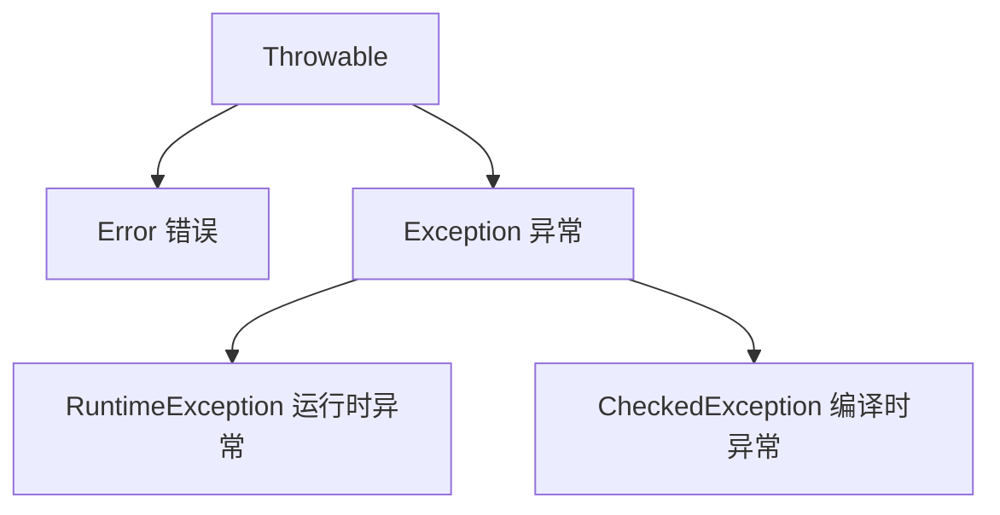

# Java 基础

> 说明：本文由旧笔记排版整理而来，只做结构、标题、代码块和表格层级优化，不改动原有知识点含义。

## 目录

- [基础语法](#基础语法)
- [修饰符](#修饰符)
- [变量](#变量)
- [源文件声明规则](#源文件声明规则)
- [Java 的两大数据类型](#java-的两大数据类型)
- [运算符](#运算符)
- [instanceof 运算符](#instanceof-运算符)
- [Number](#number)
- [String](#string)
- [数组](#数组)
- [Arrays 类](#arrays-类)
- [正则表达式](#正则表达式)
- [方法](#方法)
- [垃圾回收](#垃圾回收)
- [深拷贝和浅拷贝](#深拷贝和浅拷贝)
- [值传递和引用传递](#值传递和引用传递)
- [Exception](#exception)
- [继承](#继承)
- [重写](#重写)
- [重载](#重载)
- [多态](#多态)
- [接口和抽象类](#接口和抽象类)

## 基础语法

**大小写敏感：** Java 是大小写敏感的，这就意味着标识符 Hello 与 hello 是不同的。

**类名：** 对于所有的类来说，类名的首字母应该大写。如果类名由若干单词组成，那么每个单词的首字母应该大写，例如 MyFirstJavaClass。

**方法名：** 所有的方法名都应该以小写字母开头。如果方法名含有若干单词，则后面的每个单词首字母大写。

**常量名：** 基本数据类型的常量名使用全部大写字母，字与字之间用下划线分隔。对象常量可大小混写。例如，SIZE_NAME。

在 Java 中使用 final 关键字来修饰常量，声明方式和变量类似。

Java 所有的组成部分都需要名字。类名、变量名以及方法名都被称为标识符。

所有标识符首位都以 `a-z`、`A-Z`、`$`、`_` 开始，首位以后可以加数字。

## 修饰符

### 访问控制修饰符

- default
- public
- protected
- private

protected、private 俩不能修饰类，只能修饰变量和方法。

default：仅同包可见（“包级私有”，无修饰符）。

protected：同包 + 所有子类可见（“受保护的”）。

### 非访问控制修饰符

- final
- abstract
- static
- synchronized

静态方法不能使用类的非静态变量，访问静态方法直接类名.静态方法，类加载过程中时就被[装载和分配（待定）]()，非静态方法必须在类被实例化后才能调用。

final 表示“最后的、最终的”含义，变量一旦赋值后，不能被重新赋值。被 final 修饰的实例变量必须显式指定初始值。

final 修饰符通常和 static 修饰符一起使用来创建类常量。

final 类不能被继承，没有类能够继承 final 类的任何特性。

final 修饰方法能够防止方法被重写，还有明确标识的作用，还有起到优化作用（[JVM 内联优化]()）。

抽象方法不能被声明成 final 和 static。

任何继承抽象类的子类必须实现父类的所有抽象方法，除非该子类也是抽象类。

如果一个类包含若干个抽象方法，那么该类必须声明为抽象类。抽象类可以不包含抽象方法。

## 变量

变量就是申请内存来存储值。也就是说，当创建变量的时候，需要在内存中申请空间。

内存管理系统根据变量的类型为变量分配存储空间，分配的空间只能用来储存该类型数据。

### 局部变量

在方法、构造方法或者语句块中定义的变量被称为局部变量。变量声明和初始化都是在方法中（调用时），方法结束后，变量就会自动销毁，不区分静态方法和普通方法。

- 访问修饰符不能用于局部变量。
- 局部变量是在[栈帧（虚拟机栈）]()上分配的。
- 不能用 static 修饰。
- 局部变量没有默认值，所以局部变量被声明后，必须经过初始化，才可以使用。

### 成员变量（实例变量）

成员变量是定义在类中，方法体之外的变量。这种变量在创建对象的时候实例化。成员变量可以被类中方法、构造方法和特定类的语句块访问。

- 访问修饰符可以修饰实例变量。
- 创建被分配在[堆内存]()。
- 实例变量具有默认值。数值型变量的默认值是 0，布尔型变量的默认值是 false，引用类型变量的默认值是 null。变量的值可以在声明时指定，也可以在构造方法中或者方法中指定。
- 可通过 `object.变量名` 访问。

### 类变量（静态变量）

类变量也声明在类中，方法体之外，但必须声明为 static 类型。

静态变量在类或者类成员被第一次访问时（静态常量-常量池、子类调用父类的静态变量时除外），类被加载，静态变量也会被创建，在类被卸载时销毁。

无论一个类创建了多少个对象，类只拥有类变量的一份拷贝。

静态变量储存在[静态存储区（不同版本存在不同地方，JDK8 是堆内存了，默认为堆内存）]()。经常被声明为常量，很少单独使用 static 声明变量。

默认值和实例变量一样，可见也和实例变量一样，但大多数声明为 public，主要用来初始化常量。

可通过 `class.变量名` 访问。

`public static final` 后变量名通常大写。

避免静态变量持有大对象的长期引用，不然可能堆内存溢出。

## 源文件声明规则

- 一个源文件中只能有一个 public 类。
- 一个源文件可以有多个非 public 类。
- 源文件的名称应该和 public 类的类名保持一致。例如：源文件中 public 类的类名是 Employee，那么源文件应该命名为 Employee.java。

## Java 的两大数据类型

### 基本数据类型

- byte 数据类型是 8 位、有符号的，以二进制补码表示的整数。
- char 类型是一个单一的 16 位 Unicode 字符。
- short 数据类型是 16 位、有符号的以二进制补码表示的整数。
- int 数据类型是 32 位、有符号的以二进制补码表示的整数。
- long 数据类型是 64 位、有符号的以二进制补码表示的整数。
- float 数据类型是单精度、32 位、符合 IEEE 754 标准的浮点数。
- boolean 数据类型表示一位的信息。

### 引用数据类型

字符串、数组、自定义类、Java 自带类都是引用数据类型。所有引用类型的默认值都是 null。

### 数据类型转换

自动转换级：`byte -> short -> int -> long -> float -> double`（char 类型特殊，可自动转换为 int、long 等数值类型）。

强制类型转换是由高级到低级，浮点数到整数直接去掉的小数，而不是四舍五入。

## 运算符

Java 定义了位运算符，应用于整数类型 int、long、short、char、byte 等类型。有 `&` 与运算、`|` 或运算、`^` 异或运算、`~` 非运算、`<<` 左移、`>>` 右移等，都是转成二进制然后运算，返回值是数值（无短路）。

逻辑运算符：`&&`、`||`、`!`（有短路）。

## instanceof 运算符

该运算符用于操作对象实例，检查该对象是否是一个特定类型（类类型或接口类型），就是判断该属性或对象的类型是否正确，返回布尔值。

```java
(Object referenceVariable) instanceof (classOrInterfaceType)
```

**优先级：** 括号 > 一元（`++`、`--`、`!`、`~`）> 乘法 > 加减 > 位移（`>>`）> 关系（`>`、`<`）> 相等 > 位运算 > 逻辑运算 > 条件 > 赋值。

## Number

所有的包装类（Integer、Long、Byte、Double、Float、Short）都是抽象类 Number 的子类。

## String

String 类是不可改变的，所以你一旦创建了 String 对象，那它的值就无法改变了（详看笔记部分解析）。

> 原笔记图片待补充：String 不可变示意图。

原因是 `str += "world"` 开辟了新的内存地址，然后 str 重新指向了新的地址，旧的地址内容并没有改变。

如果需要对字符串做很多修改，那么应该选择使用 [StringBuffer & StringBuilder 类](https://www.runoob.com/java/java-stringbuffer.html "StringBuffer & StringBuilder 类")。

StringBuffer（多线程）之间的最大不同在于 StringBuilder 的方法不是线程安全的（不能同步访问），一般情况下用 StringBuilder（单线程）。创建字符串缓冲区，没超过一定大小的字符串是不是创建新对象的（新内存地址）。

### 常量池

是 Java 虚拟机（JVM）专门开辟的一块**内存区域**，核心作用是「复用字符串常量、节省内存、提升程序效率」，有字符串常量池、基本类型常量池，还有基本类型对象常量池。

### 字符串常量池

字符串常量池属于 JVM 内存中的“方法区”（存储类信息、常量、静态变量等），专门存储「字符串常量」—— 即直接用双引号包裹的字符串（如 `"a"`、`"abc"`），这些字符串一旦创建，会被池化（复用），避免相同内容的字符串重复创建，造成内存浪费。

**规则 1：直接赋值的字符串**（如 `String a = "abc";`），优先存入常量池，自动复用。

执行逻辑：JVM 先检查常量池是否有 `"abc"`，无则创建 `"abc"` 存入池，再让 a 指向池中的 `"abc"`；有则直接让 a 指向池中的 `"abc"`。

**规则 2：`new String("abc")` 会创建 2 个对象**（特殊场景，易踩坑）。

执行逻辑：

1. 检查常量池，若无 `"abc"`，先在常量池创建 `"abc"`（字符串常量）。
2. 再在堆内存创建一个 String 对象，这个对象的内容指向常量池中的 `"abc"`。
3. 最终变量指向堆内存的对象，而非常量池。

**规则 3：字符串拼接的结果，是否入池分两种情况：**

- 纯常量拼接（如 `"a" + "b"`）：编译时会直接合并为 `"ab"`，存入常量池，复用已有对象。
- 含变量拼接（如 `a + "b"`，a 是变量）：编译时无法确定结果，会在堆内存创建新对象，不会存入常量池，也不复用。

`String.intern()` 方法：手动将 string 非常量对象入池。

### 不可变的 3 个底层原因

String 类的底层是用「final 修饰的 char 数组」存储字符串内容，结合 final 的特性，实现不可变。

1. char 数组用 final 修饰：final 修饰的数组，其「引用地址不可变」—— 即 value 数组一旦创建，不能再指向其他数组（比如不能再赋值为 `new char[10]`）。
2. char 数组是 private 的：String 类没有提供任何修改 value 数组内容的方法（如 set、modify 等），外部无法直接操作数组中的元素（比如不能直接修改 `value[0]` 的值）。
3. String 类的方法均不修改原对象：String 的所有方法（如 substring、replace、concat），看似是“修改”字符串，实则都是创建一个新的 String 对象，修改新对象的 char 数组，原对象的 char 数组始终不变。

不可变目的：配合字符串常量池，实现复用、保证安全。

### 基本数据类型的常用常量和包装器变量

和 int 类似，其他 7 种基本数据类型的“常用、小范围”常量，都会存入常量池，方便复用：

- byte、short：和 int 一样，存入常用范围（byte 默认 -128~127，short 默认常用小范围）的常量。
- char：存入 0~65535 范围内的常用字符常量（如 'a'、'中'，本质是其 Unicode 码值）。
- long、float、double：仅存入“高频使用”的常量（如 0L、1.0d、3.14f），大范围值不存入。
- boolean：仅存入 true、false 两个常量（唯一值，必然存入常量池）。
- Integer：`Integer.valueOf(100)`（100 在 -128~127 范围内），会直接复用常量池中的对象。
- Character：`Character.valueOf('A')`，会复用常量池中的 'A' 对应的包装类对象。

## 数组

### 声明数组

```java
dataType[] arrayRefVar; // 首选的方法
dataType arrayRefVar[];
```

### 创建数组

```java
// 静态创建
int[] arrayRefVar = {1, 2};

// 动态创建
int[] arrayRefVar = new int[5];
```

### 二维数组

二维数组也可以静态和动态创建：

```java
type[][] typeName = new type[typeLength1][typeLength2];
```

## Arrays 类

`java.util.Arrays` 类能方便地操作数组，它提供的所有方法都是静态的，有排序 `sort`、`toString` 转字符串、数组填充 `fill` 等。

## 正则表达式

可以使用字符串自带的方法简单匹配：`matches`、`replaceAll`、`split`。

也可以用 Pattern 和 Matcher 类：

```java
String str = "Java123，Python456，C789";

// 1. 编译正则（规则：匹配1个及以上数字）
Pattern pattern = Pattern.compile("\\d+");

// 2. 创建匹配器，关联目标字符串
Matcher matcher = pattern.matcher(str);
```

## 方法

方法的参数范围涵盖整个方法。参数实际上是一个局部变量。

### 重载

一个类中定义多个同名的方法，但要求每个方法具有不同的参数的类型或参数的个数。

1. 方法名一定要相同。
2. 方法的参数表必须不同，包括参数的类型或个数，以此区分不同的方法体。
3. 如果参数个数不同，就不管它的参数类型了。
4. 如果参数个数相同，那么参数的类型必须不同。
5. 方法的返回类型、[修饰符](https://baike.baidu.com/item/%E4%BF%AE%E9%A5%B0%E7%AC%A6)可以相同，也可不同。

### 可变参数

`typeName... parameterName` 作为方法的参数，前面是类型，后面是参数名，调用一个元素直接 `parameterName[i]`。

### 主方法（main 方法）

程序的“入口”，JVM 运行程序时，会优先执行 main 方法，格式固定为：

```java
public static void main(String[] args) {
    // ...
}
```

不可随意修改（除了 args 参数名可自定义）。

## 垃圾回收

没有被引用的对象会被回收，主要是堆内存中的对象以及方法区常量池里面的部分常量，不可控，开发只需要把引用置为 null 即可。

Java 允许定义这样的方法，它在对象被垃圾收集器析构（回收）之前调用，这个方法叫做 `finalize()`，它用来清除回收对象。

```java
public class FinalizationDemo {
    public static void main(String[] args) {
        Cake c1 = new Cake(1);
        Cake c2 = new Cake(2);
        Cake c3 = new Cake(3);
        c2 = c3 = null;
        System.gc();
        // 调用 Java 垃圾收集器
    }
}

class Cake extends Object {
    private int id;

    public Cake(int id) {
        this.id = id;
        System.out.println("Cake Object " + id + "is created");
    }

    protected void finalize() throws java.lang.Throwable {
        super.finalize();
        System.out.println("Cake Object " + id + "is disposed");
    }
}
```

## 深拷贝和浅拷贝

- 浅拷贝：对基本数据类型是进行值拷贝，对引用数据类型是进行引用的拷贝。
- 深拷贝：对基本数据类型是进行值拷贝，对引用数据类型是会创建一个新的对象对其内容的复制的拷贝。

## 值传递和引用传递

- 值传递：函数参数传递方式是值的拷贝或者对象引用的拷贝，不能够直接在函数内部修改值或者对象引用地址，只能够修改对象引用的状态。所以 Java 都是值传递。
- 引用传递：函数参数传递的是对象的引用，可以在函数内部修改对象的引用地址，一般在 C++ 或者 Python 中才能见到。

## Exception

Java 中所有异常都继承自 `Throwable` 类，核心分为两大分支：



| 类型 | 说明 | 常见示例 | 处理方式 |
|---|---|---|---|
| Error（错误） | JVM 层面的严重问题，程序无法处理，会直接导致程序崩溃 | OutOfMemoryError（内存溢出）、StackOverflowError（栈溢出） | 无法处理，只能通过优化代码 / 配置避免 |
| RuntimeException（运行时异常） | 程序逻辑错误导致，编译时不强制处理，运行时才会暴露 | NullPointerException（空指针）、ArrayIndexOutOfBoundsException（数组越界）、ArithmeticException（除 0） | 编码时规避（如判空、校验索引），也可捕获处理 |
| CheckedException（编译时异常） | 程序外部因素导致（如文件找不到、网络中断），编译时必须处理，否则报错 | IOException（IO 异常）、SQLException（数据库异常）、ClassNotFoundException | 必须用 try-catch 捕获 或 throws 抛出 |

Java 处理异常的核心是**捕获（try-catch）**和**抛出（throws/throw）**，优先掌握 try-catch 即可。

### 1. 捕获异常（try-catch-finally）

不管异不异常 finally 都会执行，在 try 块中打开资源，在 finally 块中清理释放这些资源，try 块中的局部变量和 catch 块中的局部变量（包括异常变量），以及 finally 中的局部变量，他们之间不可共享使用。

一个 catch 块用于处理一个异常。异常匹配是按照 catch 块的顺序从上往下寻找的，只有第一个匹配的 catch 会得到执行。匹配时，不仅运行精确匹配，也支持父类匹配，因此，如果同一个 try 块下的多个 catch 异常类型有父子关系，应该将子类异常放在前面，父类异常放在后面，这样保证每个 catch 块都有存在的意义。

### 三个关于 finally 的不寻常案例

- finally 中的 return 会覆盖 try 或者 catch 中的返回值，因为存放的返回值指向同一个地址。
- finally 中的 return 会抑制（消灭）前面 try 或者 catch 块中的异常。
- finally 中的异常会覆盖（消灭）前面 try 或者 catch 中的异常。

将尽量将所有的 return 写在函数的最后面，而不是 try ... catch ... finally 中。

### 2. 抛出异常（throws/throw）

**throws：** 声明方法可能抛出的异常，把异常“甩给调用者处理”，发生在方法本身不知道如何处理这样的异常，或者说让调用者处理更好，调用者需要为可能发生的异常负责。

适用于编译时异常；Java 运行。

```java
// 方法声明处抛出 IOException，调用该方法的代码必须处理这个异常
public static void readFile() throws IOException {
    FileReader fr = new FileReader("test.txt");
    fr.read();
}
```

**throw：** 手动抛出具体的异常对象，适用于自定义业务异常（入门了解）；Java 运行。

```java
public static void checkAge(int age) {
    if (age < 0) {
        // 手动抛出运行时异常
        throw new IllegalArgumentException("年龄不能为负数");
    }
    System.out.println("年龄合法：" + age);
}
```

**异常链化：** 以一个异常对象为参数构造新的异常对象。新的异对象将包含先前异常的信息。

注意：为了支持多态，父类方法 throws 的是 2 个异常，子类就不能 throws 3 个及以上的异常。父类 throws IOException，子类就必须 throws IOException 或者 IOException 的子类。Java 中的异常是线程独立的，线程的问题应该由线程自己来解决，而不要委托到外部，也不会直接影响到其它线程的执行。

## 继承

让一个类（子类 / 派生类）获取另一个类（父类 / 基类）的非私有属性和方法（构造方法不行、final 修饰的方法不行），核心目的是**代码复用**、建立类之间的层级关系，但是提高了类之间的耦合性（继承的缺点，耦合度高就会造成代码之间的联系越紧密，代码独立性越差）。

super 可以理解为是指向自己超（父）类对象的一个指针，而这个超类指的是离自己最近的一个父类。

this 是自身的一个对象，代表对象本身，可以理解为：指向对象本身的一个指针。

> 原笔记图片待补充：this 指针示意图。

子类是不继承父类的构造器（构造方法或者构造函数）的，它只是调用（隐式或显式）。子类的构造函数默认第一行会默认调用父类无参的构造函数，JVM 自动加的隐式语句。

> 原笔记图片待补充：super 构造调用示意图。

如果父类的构造器带有参数，可以在子类的构造器中显式地通过 **super** 关键字调用父类的构造器并配以适当的参数列表。

调用本类的其它构造方法，它必须作为构造方法的第一句。

> 原笔记图片待补充：this 构造调用示意图。

## 重写

是子类对父类中**非 private、非 final、非 static** 的方法，重新实现逻辑，核心目的是**适配子类的特有行为**，是实现多态的基础。返回值和形参都不能改变。**即外壳不变，核心重写！**

- 声明为 final 的方法不能被重写。
- 声明为 static 的方法不能被重写，但是能够被再次声明。
- 方法重写时，方法名与形参列表必须一致。
- 方法重写时，子类的权限修饰符必须要大于或者等于父类的权限修饰符。
- 方法重写时，子类的返回值类型必须要小于或者等于父类的返回值类型。
- 方法重写时，子类抛出的异常类型要小于或者等于父类抛出的异常类型。Exception（最坏）RuntimeException（小坏）。
- 如果不能继承一个方法，则不能重写这个方法。所以，构造方法不能被重写。

## 重载

- 被重载的方法必须改变参数列表（参数个数或类型不一样）。
- 被重载的方法可以改变返回类型。
- 被重载的方法可以改变访问修饰符。
- 被重载的方法可以声明新的或更广的检查异常。
- 方法能够在同一个类中或者在一个子类中被重载。
- **无法以返回值类型**作为重载函数的区分标准。

## 多态

优点：消除类型之间的耦合关系、使程序有良好的扩展性。

实现方式：重写、接口、抽象类和抽象方法。

必要条件：继承、重写、父类引用指向子类对象。

```java
Parent p = new Child();
```

### 虚函数

```java
Parent p = new Child();
p.mailCheck();
```

在编译的时候，编译器使用 Parent 类中的 mailCheck() 方法验证该语句，但是在运行的时候，Java 虚拟机（JVM）调用的是 Child 类中的 mailCheck() 方法。以上整个过程被称为虚拟方法调用，该方法被称为虚拟方法。

## 接口和抽象类

### 相同点

| 相同点 | 详细说明 |
|---|---|
| 无法直接实例化 | 抽象类：不能 `new AbstractClass()`；接口：不能 `new Interface()`；实例化只能通过「实现 / 继承的子类」：`AbstractClass obj = new 子类();`、`Interface obj = new 实现类();` |
| 包含未实现的方法声明 | 抽象类可包含抽象方法（未实现）；接口默认所有方法都是未实现的（JDK8+ 支持默认方法，但核心仍为抽象方法） |
| 用于规范行为 | 两者都是“契约”的体现：抽象类通过抽象方法约束子类必须实现的逻辑；接口通过方法声明约束实现类的行为 |
| 子类 / 实现类未全实现抽象方法时，自身需为抽象类 | 抽象类的子类若未重写所有抽象方法，子类必须加 `abstract`；接口的实现类若未重写所有方法，实现类必须加 `abstract` |

### 区别

| 对比维度 | 抽象类（Abstract Class） | 接口（Interface） | 进阶补充 / 注意事项 |
|---|---|---|---|
| **本质定位** | 「类的抽象」：是对**一类事物的共性抽象或者模板**（is-a 关系），包含部分实现 | 「行为的抽象」：是对**一组行为的规范或者能力**（has-a 关系），仅定义契约，不关注归属 | 抽象类是“半实现”，接口是“纯规范”；抽象类侧重**代码复用**，接口侧重**解耦和多态扩展** |
| **继承 / 实现规则** | 单继承：一个类只能继承一个抽象类 | 多实现：一个类可实现多个接口；接口可多继承接口（`interface A extends B,C`） | 接口多继承是 JDK 允许的唯一“多继承”形式；抽象类的单继承限制可通过“抽象类 + 接口”弥补 |
| **构造方法** | 有构造方法（可含参 / 无参），但不能直接调用（因无法实例化）；子类构造会隐式调用抽象类的构造（`super()`） | 无构造方法（接口不是类，不存在实例初始化逻辑） | 抽象类构造方法的作用：初始化抽象类中的非抽象成员变量，子类必须先完成抽象类的初始化才能使用其属性 / 方法 |
| **方法特性** | 1. 可包含抽象方法（`abstract`）、普通方法（有实现）、静态方法；2. 抽象方法不能是 `static/private/final`；3. JDK8+ 支持默认方法（`default`）、静态方法 | 1. JDK7 及以前：仅能声明抽象方法（隐式 `public abstract`）；2. JDK8+：支持默认方法（`default`）、静态方法（`static`）；3. JDK9+：支持私有方法（`private`）；4. 所有方法默认 `public`，不能是 `private/final` | 进阶：1. 接口的默认方法可实现逻辑，用于接口升级（避免修改所有实现类）；2. 抽象类的普通方法可被子类重写（除非加 `final`），接口的默认方法也可被实现类重写 |
| **成员变量** | 可包含任意类型变量（`public/private/protected/static/final` 均可），默认是普通变量 | JDK7 及以前：仅能声明 `public static final` 常量（隐式，写不写都一样）；JDK8+：无新增变量规则，仍为常量 | 进阶：接口变量本质是“全局常量”，赋值后不可修改；抽象类的变量可被子类继承并修改（非 final 时） |
| **访问修饰符** | 方法 / 变量可使用 `public/protected/private`（抽象方法不能是 `private`） | 所有方法默认 `public`，变量默认 `public static final`；不能使用 `protected/private` 修饰方法 / 变量 | 接口的访问修饰符限制是为了保证“契约的公开性”，抽象类则可通过 `protected` 控制子类的访问范围 |
| **抽象方法的强制实现** | 子类必须重写所有抽象方法（除非子类也是抽象类）；普通方法无需重写 | 实现类必须重写所有抽象方法（除非实现类是抽象类）；默认方法可选择重写或直接使用 | 进阶：接口的默认方法若被多个父接口重复定义，实现类必须显式重写该方法（避免冲突） |
| **静态方法特性** | 抽象类的静态方法属于类，可直接通过抽象类名调用（`AbstractClass.staticMethod()`） | 接口的静态方法属于接口，只能通过接口名调用（`Interface.staticMethod()`），实现类无法继承 | 抽象类静态方法无多态性，接口静态方法同理；抽象类静态方法可用于工具类逻辑，接口静态方法多用于接口的辅助逻辑 |
| **使用场景** | 1. 多个类有“共性实现”（如父类已有部分方法实现，子类只需补充抽象方法）；2. 需要定义成员变量（非常量）；3. 需要控制方法 / 变量的访问权限（如 `protected`） | 1. 多个类有“共性行为但无共性实现”（如 `Runnable`、`Serializable`）；2. 需实现多继承效果；3. 解耦：定义规范，不关心实现细节；4. 框架设计（如 Spring 的 `BeanPostProcessor`） | 进阶：抽象类适合“模板方法模式”：抽象类定义骨架，子类实现细节；接口适合“策略模式”：不同实现类提供不同策略，通过接口统一调用 |
