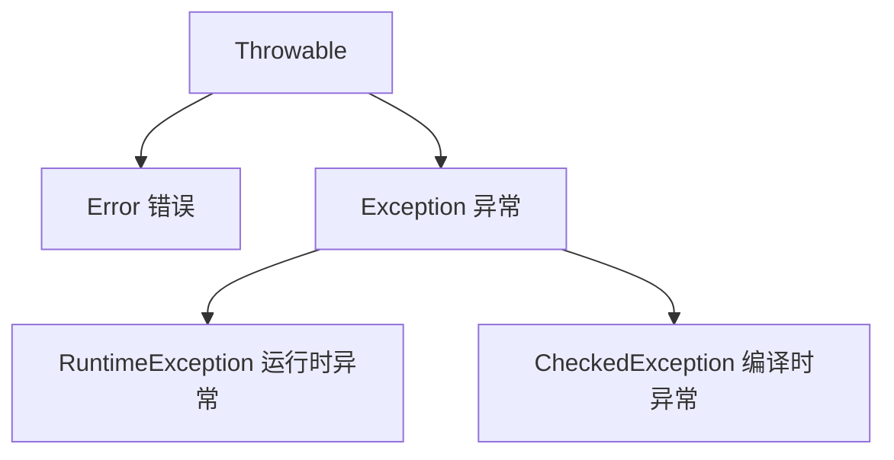

### Java 基础原始笔记

> 原始导入内容，仅作为备份保留；正式归纳请看 [Java 基础知识点清单](../知识点梳理/java基础.md) 和 [Java 基础总结](../java总结.md)。

* ***基础语法：***
  
  \*\*大小写敏感：\*\*Java 是大小写敏感的，这就意味着标识符 Hello 与 hello 是不同的。
  
  \*\*类名：\*\*对于所有的类来说，类名的首字母应该大写。如果类名由若干单词组成，那么每个单词的首字母应该大写，例如 MyFirstJavaClass 。
  
  \*\*方法名：\*\*所有的方法名都应该以小写字母开头。如果方法名含有若干单词，则后面的每个单词首字母大写。
  
  \*\*常量名：\*\*基本数据类型的常量名使用全部大写字母，字与字之间用下划线分隔。对象常量可大小混写。例如，SIZE\_NAME。
  
  在 Java 中使用 final 关键字来修饰常量，声明方式和变量类似：
  
  Java 所有的组成部分都需要名字。类名、变量名以及方法名都被称为标识符。
  
  所有标识符首位都以azAZ\$\_开始，首位以后可以加数字

* ***修饰符：***
  
  **访问控制修饰符 :** default, public , protected, private
  
  protected, private 俩不能修饰类，只能修饰变量和方法
  
  default：仅同包可见（“包级私有”，无修饰符）
  
  protected：同包 + 所有子类可见（“受保护的”）
  
  **非访问控制修饰符 :** final, abstract, static, synchronized
  
  静态方法不能使用类的非静态变量，访问静态方法直接类名.静态方法，类加载过程中时就被[装载和分配（待定）]()，非静态方法必须在类被实例化后才能调用
  
  final 表示"最后的、最终的"含义，变量一旦赋值后，不能被重新赋值。被 final 修饰的实例变量必须显式指定初始值。
  
  final 修饰符通常和 static 修饰符一起使用来创建类常量。
  
  final 类不能被继承，没有类能够继承 final 类的任何特性。
  
  final修饰方法能够防止方法被重写，还有明确标识的作用，还有起到优化作用（[jvm内联优化]()）
  
  抽象方法不能被声明成 final 和 static。
  
  任何继承抽象类的子类必须实现父类的所有抽象方法，除非该子类也是抽象类。
  
  如果一个类包含若干个抽象方法，那么该类必须声明为抽象类。抽象类可以不包含抽象方法。

* ***变量：***
  
  变量就是申请内存来存储值。也就是说，当创建变量的时候，需要在内存中申请空间。
  
  内存管理系统根据变量的类型为变量分配存储空间，分配的空间只能用来储存该类型数据。
  
  \*\*局部变量：\*\*在方法、构造方法或者语句块中定义的变量被称为局部变量。变量声明和初始化都是在方法中（调用时），方法结束后，变量就会自动销毁，不区分静态方法和普通方法。
  
  访问修饰符不能用于局部变量；
  
  局部变量是在[栈帧（虚拟机栈]()）上分配的。
  
  不能用static修饰
  
   局部变量没有默认值，所以局部变量被声明后，必须经过初始化，才可以使用。
  
  \*\*成员变量（实例变量）：\*\*成员变量是定义在类中，方法体之外的变量。这种变量在创建对象的时候实例化。成员变量可以被类中方法、构造方法和特定类的语句块访问。
  
  访问修饰符可以修饰实例变量；
  
  创建被分配在[堆内存]()
  
  实例变量具有默认值。数值型变量的默认值是0，布尔型变量的默认值是false，引用类型变量的默认值是null。变量的值可以在声明时指定，也可以在构造方法中或者方法中指定；
  
  可通过object.变量名访问
  
  \*\*类变量（静态变量）：\*\*类变量也声明在类中，方法体之外，但必须声明为static类型。
  
  静态变量在类或者类成员被第一次访问时（
  
  静态常量-常量池、 子类调用父类的静态变量时除外），类被加载，静态变量也会被创建，在类被卸载时销毁。
  
  无论一个类创建了多少个对象，类只拥有类变量的一份拷贝
  
  静态变量储存在[静态存储区（不同版本存在不同地方，jdk8是堆内存了，默认为堆内存]()）。经常被声明为常量，很少单独使用static声明变量。
  
  默认值和实例变量一样，可见也和实例变量一样，但大多数声明为public，主要用来初始化常量
  
  可通过class.变量名访问
  
  public static final后变量名通常大写
  
  避免静态变量持有大对象的长期引用，不然可能堆内存溢出

* ***源文件声明规则：***
  
  一个源文件中只能有一个public类
  
  一个源文件可以有多个非public类
  
  源文件的名称应该和public类的类名保持一致。例如：源文件中public类的类名是Employee，那么源文件应该命名为Employee.java。

* ***Java 的两大数据类型:***
  
  **基本数据类型：**
  
  byte 数据类型是8位、有符号的，以二进制补码表示的整数；
  
  char类型是一个单一的 16 位 Unicode 字符；
  
  short 数据类型是 16 位、有符号的以二进制补码表示的整数
  
  int 数据类型是32位、有符号的以二进制补码表示的整数；
  
  long 数据类型是 64 位、有符号的以二进制补码表示的整数；
  
  float 数据类型是单精度、32位、符合IEEE 754标准的浮点数；
  
  boolean数据类型表示一位的信息；
  
  **引用数据类型：**
  
  字符串、数组、自定义类、java自带类都是引用数据类型。所有引用类型的默认值都是null。
  
   
  
  \*\*数据类型：\*\*自动转换级：byte → short → int → long → float → double（char类型特殊，可自动转换为int、long等数值类型）
  
  强制类型转换是由高级到低级，浮点数到整数直接去掉的小数，而不是四舍五入

* ***运算符：***
  
  Java定义了位运算符，应用于整数类型(int)，长整型(long)，短整型(short)，字符型(char)，和字节型(byte)等类型。有&与运算、|或运算、^异或运算、\~非运算、<<左移、 >>右移等，都是转成二进制然后运算，返回值是数值’  （无短路）
  
  逻辑运算符&&、||、! （有短路）

* ***instanceof 运算符：***
  
  该运算符用于操作对象实例，检查该对象是否是一个特定类型（类类型或接口类型），就是判断该属性或对象的类型是否正确，返回布尔值
  
  ( Object reference variable ) instanceof  (class/interface type)
  
  \*\*优先级：\*\*括号>一元（++，--，！，\~）>乘法>加减>位移（>>）>关系（>、<）>相等>位运算>逻辑运算>条件>赋值
  
   

* ***Number：***
  
  所有的包装类\*\*（Integer、Long、Byte、Double、Float、Short）\*\*都是抽象类 Number 的子类。

* ***String：***
  
  String 类是不可改变的，所以你一旦创建了 String 对象，那它的值就无法改变了（详看笔记部分解析）。
  
   
  
  原因是str+=”world”开辟了新的内存地址，然后str重新指向了新的地址，旧的地址内容并没有改变。
  
  如果需要对字符串做很多修改，那么应该选择使用 [StringBuffer & StringBuilder 类](https://www.runoob.com/java/java-stringbuffer.html "StringBuffer & StringBuilder 类")。
  
  StringBuffer（多线程） 之间的最大不同在于 StringBuilder 的方法不是线程安全的（不能同步访问），一般情况下用StringBuilder（单线程）。。。。创建字符串缓冲区，没超过一定大小的字符串是不是创建新对象的（新内存地
  
  址）。
  
  **[常量池]()：**
  
  是Java虚拟机（JVM）专门开辟的一块**内存区域**，核心作用是「复用字符串常量、节省内存、提升程序效率」，有字符串常量池、基本类型常量池，还有基本类型对象常量池
  
  **字符串常量池：**
  
  字符串常量池属于JVM内存中的“方法区”（存储类信息、常量、静态变量等），专门存储「字符串常量」—— 即直接用双引号包裹的字符串（如`"a"`、`"abc"`），这些字符串一旦创建，会被池化（复用），避免相同内容的字符串重复创建，造成内存浪费。
  
  规则1：直接赋值的字符串（如`String a = "abc";`），优先存入常量池，自动复用。 - 执行逻辑：JVM先检查常量池是否有“abc” → 无则创建“abc”存入池，再让a指向池中的“abc”；有则直接让a指向池中的“abc”。
  
  规则2：`new String("abc")` 会创建2个对象（特殊场景，易踩坑）。 - 执行逻辑：① 检查常量池，若无“abc”，先在常量池创建“abc”（字符串常量）；② 再在堆内存创建一个String对象，这个对象的内容指向常量池中的“abc”；③ 最终变量指向堆内存的对象，而非常量池。
  
  规则3：字符串拼接的结果，是否入池分两种情况： - 纯常量拼接（如`"a" + "b"`）：编译时会直接合并为`"ab"`，存入常量池，复用已有对象； - 含变量拼接（如`a + "b"`，a是变量）：编译时无法确定结果，会在堆内存创建新对象，不会存入常量池，也不复用。
  
  String.intern()方法（手动将string非常量对象入池）

* 不可变的3个底层原因（String类的底层是用「final修饰的char数组」存储字符串内容，结合final的特性，实现不可变。）：
  
  1. char数组用final修饰：final修饰的数组，其「引用地址不可变」—— 即value数组一旦创建，不能再指向其他数组（比如不能再赋值为new char\[10]）。
  2. char数组是private的：String类没有提供任何修改value数组内容的方法（如set、modify等），外部无法直接操作数组中的元素（比如不能直接修改value\[0]的值）。
  3. String类的方法均不修改原对象：String的所有方法（如substring、replace、concat），看似是“修改”字符串，实则都是创建一个新的String对象，修改新对象的char数组，原对象的char数组始终不变。
     ==不可变目的：配合字符串常量池，实现复用、保证安全==
  
  基本数据类型的常用常量和包装器变量（不止 int）
  
  和 int 类似，其他 7 种基本数据类型的 “常用、小范围” 常量，都会存入常量池，方便复用：
  
  * byte、short：和 int 一样，存入常用范围（byte 默认 - 128\~127，short 默认常用小范围）的常量；
  * char：存入 0\~65535 范围内的常用字符常量（如 'a'、' 中 '，本质是其 Unicode 码值）；
  * long、float、double：仅存入 “高频使用” 的常量（如 0L、1.0d、3.14f），大范围值不存入；
  * boolean：仅存入 true、false 两个常量（唯一值，必然存入常量池）。
  * Integer：`Integer.valueOf(100)`（100 在 - 128\~127 范围内），会直接复用常量池中的对象；
  * Character：`Character.valueOf('A')`，会复用常量池中的 'A' 对应的包装类对象。

* ***数组：***
  
  声明数组
  
  dataType\[] arrayRefVar; // 首选的方法 或 dataType arrayRefVar\[];
  
  创建数组
  
  静态创建-> int\[] arrayRefVar = {1,2}
  
  动态创建-> int\[] arrayRefVar = new int\[5];
  
   
  
  二维数组(也可以静态和动态创建)：
  
  type\[]\[] typeName = new type\[typeLength1]\[typeLength2];

* ***Arrays 类***
  
  java.util.Arrays 类能方便地操作数组，它提供的所有方法都是静态的，有排序sort、toString转字符串、数组填充fill等。

* ***正则表达式：***
  
  可以使用字符串自带的方法简单匹配：matches、replaceAll、split
  
  也可以用Pattern和Matcher类：
  
  String str = "Java123，Python456，C789"; // 1. 编译正则（规则：匹配1个及以上数字） Pattern pattern = Pattern.compile("\\\d+"); // 2. 创建匹配器，关联目标字符串 Matcher matcher = pattern.matcher(str);

* ***方法：***
  
  方法的参数范围涵盖整个方法。参数实际上是一个局部变量。
  
  \*\*重载：\*\*一个类中定义多个同名的方法，但要求每个方法具有不同的参数的类型或参数的个数。
  
  一.方法名一定要相同。
  
  二.方法的参数表必须不同，包括参数的类型或个数，以此区分不同的方法体。
  
  1.如果参数个数不同，就不管它的参数类型了！
  
  2.如果参数个数相同，那么参数的类型必须不同。
  
  三.方法的返回类型、[修饰符](https://baike.baidu.com/item/%E4%BF%AE%E9%A5%B0%E7%AC%A6)可以相同，也可不同。

* \***可变参数**：\*typeName... parameterName作为方法的参数，前面是类型，后面是参数名，调用一个元素直接parameterName\[i]

* ***主方法（main方法）**：*
  
  程序的“入口”，JVM运行程序时，会优先执行main方法，格式固定为 `public static void main(String[] args) { ... }`，不可随意修改（除了args参数名可自定义）

* ***垃圾回收：***
  
  没有被引用的对象会被回收，主要是堆内存中的对象以及方法区常量池里面的部分常量，不可控，开发只需要把引用置为null即可
  
  Java 允许定义这样的方法，它在对象被垃圾收集器析构(回收)之前调用，这个方法叫做 finalize( )，它用来清除回收对象。
  
  `public class FinalizationDemo { `
  
  `public static void main(String[] args) `
  
  `{ `
  
  `Cake c1 = new Cake(1);`
  
  `Cake c2 = new Cake(2);`
  
  ` Cake c3 = new Cake(3);`
  
  ` c2 = c3 = null;`
  
  ` System.gc();`
  
  ` //调用Java垃圾收集器 } }`
  
  ` class Cake extends Object { `
  
  `private int id;`
  
  `public Cake(int id) {`
  
  ` this.id = id;`
  
  `System.out.println("Cake Object " + id + "is created");`
  
  `} `
  
  `protected void finalize() throws java.lang.Throwable { `
  
  `super.finalize();`
  
  `System.out.println("Cake Object " + id + "is disposed");`
  
  `} }`

* ***深拷贝和浅拷贝***
  
  * 浅拷贝：对基本数据类型是进行值拷贝， 对引用数据类型是进行引用的拷贝
  * 深拷贝：对基本数据类型是进行值拷贝， 对引用数据类型是会创建一个新的对象对其内容的复制的拷贝

* ***值传递和引用传递***
  
  * 值传递， 函数参数传递方式是值的拷贝或者对象引用的拷贝， 不能够直接在函数内部修改值或者对象引用地址， 只能够修改对象引用的状态。 所以java都是值传递
  * 引用传递， 函数参数传递的是对象的引用，可以在函数内部修改对象的引用地址， 一般在c++或者Python中才能见到

* ***Exception：***
  
  Java 中所有异常都继承自 `Throwable` 类，核心分为两大分支：



| 类型                      | 说明                                 | 常见示例                                                                                    | 处理方式                         |
|:-----------------------:|:----------------------------------:|:---------------------------------------------------------------------------------------:|:----------------------------:|
| Error（错误）               | JVM 层面的严重问题，程序无法处理，会直接导致程序崩溃       | OutOfMemoryError（内存溢出）、StackOverflowError（栈溢出）                                          | 无法处理，只能通过优化代码 / 配置避免         |
| RuntimeException（运行时异常） | 程序逻辑错误导致，编译时不强制处理，运行时才会暴露          | NullPointerException（空指针）、ArrayIndexOutOfBoundsException（数组越界）、ArithmeticException（除 0） | 编码时规避（如判空、校验索引），也可捕获处理       |
| CheckedException（编译时异常） | 程序外部因素导致（如文件找不到、网络中断），编译时必须处理，否则报错 | IOException（IO 异常）、SQLException（数据库异常）、ClassNotFoundException                           | 必须用 try-catch 捕获 或 throws 抛出 |

  Java 处理异常的核心是 **捕获（try-catch）** 和 **抛出（throws/throw）**，优先掌握 try-catch 即可。

###### 1. 捕获异常（try-catch-finally）

  不管异不异常finally都会执行，在try块中打开资源，在finally块中清理释放这些资源，try块中的局部变量和catch块中的局部变量（包括异常变量），以及finally中的局部变量，他们之间不可共享使用

  一个catch块用于处理一个异常。异常匹配是按照catch块的顺序从上往下寻找的，只有第一个匹配的catch会得到执行。匹配时，不仅运行精确匹配，也支持父类匹配，因此，如果同一个try块下的==多个catch异常类型有父子关系，应该将子类异常放在前面，父类异常放在后面==，这样保证每个catch块都有存在的意义。

  **三个关于finally的不寻常的案例**

  finally中的return 会覆盖 try 或者catch中的返回值，因为存放的返回值指向同一个地址

  finally中的return会抑制（消灭）前面try或者catch块中的异常

  finally中的异常会覆盖（消灭）前面try或者catch中的异常

  将尽量将所有的return写在函数的最后面，而不是try ... catch ... finally中。

  2.抛出异常（throws/throw）

* **throws**：声明方法可能抛出的异常，把异常 “甩给调用者处理”，发生在方法本身不知道如何处理这样的异常，或者说让调用者处理更好，调用者需要为可能发生的异常负责
  
  适用于==编译时异常==；java运行
  
  ```
  // 方法声明处抛出IOException，调用该方法的代码必须处理这个异常
  public static void readFile() throws IOException {
      FileReader fr = new FileReader("test.txt");
      fr.read();
  }
  ```

* **throw**：手动抛出具体的异常对象，适用于自定义业务异常（入门了解）；java运行
  
      public static void checkAge(int age) {
          if (age < 0) {
              // 手动抛出运行时异常
              throw new IllegalArgumentException("年龄不能为负数");
          }
          System.out.println("年龄合法：" + age);
      }

\*\*异常链化:\*\*以一个异常对象为参数构造新的异常对象。新的异对象将包含先前异常的信息

注意：为了支持多态，父类方法throws 的是2个异常，子类就不能throws 3个及以上的异常。父类throws IOException，子类就必须throws IOException或者IOException的子类。Java中的异常是线程独立的，线程的问题应该由线程自己来解决，而不要委托到外部，也不会直接影响到其它线程的执行

**继承**

让一个类（子类 / 派生类）获取另一个类（父类 / 基类）的非私有属性和方法（构造方法不行、final修饰的方法不行），核心目的是**代码复用**、建立类之间的层级关系，但是提高了类之间的耦合性（继承的缺点，耦合度高就会造成代码之间的联系越紧密，代码独立性越差）。

super可以理解为是指向自己超（父）类对象的一个指针，而这个超类指的是离自己最近的一个父类。

this是自身的一个对象，代表对象本身，可以理解为：指向对象本身的一个指针。

子类是不继承父类的构造器（构造方法或者构造函数）的，它只是调用（隐式或显式）。子类的构造函数默认第一行会默认调用父类无参的构造函数，jvm自动加的隐式语句。如果父类的构造器带有参数，可以在子类的构造器中显式地通过 **super** 关键字调用父类的构造器并配以适当的参数列表。

调用本类的其它构造方法，它必须作为构造方法的第一句。

**重写**

是子类对父类中**非 private、非 final、非 static** 的方法，重新实现逻辑，核心目的是**适配子类的特有行为**，是实现多态的基础。 返回值和形参都不能改变。**即外壳不变，核心重写！**

声明为 final 的方法不能被重写。

声明为 static 的方法不能被重写，但是能够被再次声明。

.方法重写时， 方法名与形参列表必须一致。

方法重写时，子类的权限修饰符必须要大于或者等于父类的权限修饰符。

方法重写时，子类的返回值类型必须要小于或者 等于父类的返回值类型。

方法重写时， 子类抛出的异常类型要小于或者等于父类抛出的异常类型。 Exception(最坏) RuntimeException(小坏)

如果不能继承一个方法，则不能重写这个方法。所以，构造方法不能被重写。

**重载**

被重载的方法必须改变参数列表(参数个数或类型不一样)；

被重载的方法可以改变返回类型；

被重载的方法可以改变访问修饰符；

被重载的方法可以声明新的或更广的检查异常；

方法能够在同一个类中或者在一个子类中被重载。

**无法以返回值类型**作为重载函数的区分标准。

**多态：**

优点：消除类型之间的耦合关系、使程序有良好的扩展性

实现方式：重写、接口、抽象类和抽象方法

**必要条件：继承、重写、父类引用指向子类对象**

Parent p = new Child();

**虚函数（Parent p = new Child(); p.mailCheck();**）：

在编译的时候，编译器使用 Parent 类中的 mailCheck() 方法验证该语句， 但是在运行的时候，Java虚拟机(JVM)调用的是 Child 类中的 mailCheck() 方法。以上整个过程被称为虚拟方法调用，该方法被称为虚拟方法。

***接口和抽象类：***

| 相同点                       | 详细说明                                                                                                                                  |
|:-------------------------:|:-------------------------------------------------------------------------------------------------------------------------------------:|
| 无法直接实例化                   | 抽象类：不能 `new AbstractClass()`；接口：不能 `new Interface()`；实例化只能通过「实现 / 继承的子类」：`AbstractClass obj = new 子类();`、`Interface obj = new 实现类();` |
| 包含未实现的方法声明                | 抽象类可包含抽象方法（未实现）；接口默认所有方法都是未实现的（JDK8+ 支持默认方法，但核心仍为抽象方法）                                                                                |
| 用于规范行为                    | 两者都是 “契约” 的体现：抽象类通过抽象方法约束子类必须实现的逻辑；接口通过方法声明约束实现类的行为                                                                                   |
| 子类 / 实现类未全实现抽象方法时，自身需为抽象类 | 抽象类的子类若未重写所有抽象方法 → 子类必须加 `abstract`；接口的实现类若未重写所有方法 → 实现类必须加 `abstract`                                                                |

| 对比维度          | 抽象类（Abstract Class）                                                                                     | 接口（Interface）                                                                                                                                          | 进阶补充 / 注意事项                                                                         |
|:-------------:|:-------------------------------------------------------------------------------------------------------:|:------------------------------------------------------------------------------------------------------------------------------------------------------:|:-----------------------------------------------------------------------------------:|
| **本质定位**      | 「类的抽象」：是对**一类事物的共性抽象或者模板**（is-a 关系），包含部分实现                                                              | 「行为的抽象」：是对**一组行为的规范或者能力**（has-a 关系），仅定义契约，不关注归属                                                                                                        | 抽象类是 “半实现”，接口是 “纯规范”；抽象类侧重**代码复用**，接口侧重**解耦和多态扩展**                                  |
| **继承 / 实现规则** | 单继承：一个类只能继承一个抽象类                                                                                        | 多实现：一个类可实现多个接口；接口可多继承接口（`interface A extends B,C`）                                                                                                     | 接口多继承是 JDK 允许的唯一 “多继承” 形式；抽象类的单继承限制可通过 “抽象类 + 接口” 弥补                                |
| **构造方法**      | 有构造方法（可含参 / 无参），但不能直接调用（因无法实例化）；子类构造会隐式调用抽象类的构造（`super()`）                                              | 无构造方法（接口不是类，不存在实例初始化逻辑）                                                                                                                                | 抽象类构造方法的作用：初始化抽象类中的非抽象成员变量，子类必须先完成抽象类的初始化才能使用其属性 / 方法                               |
| **方法特性**      | 1. 可包含抽象方法（`abstract`）、普通方法（有实现）、静态方法；2. 抽象方法不能是 `static/private/final`；3. JDK8+ 支持默认方法（`default`）、静态方法 | 1. JDK7 及以前：仅能声明抽象方法（隐式 `public abstract`）；2. JDK8+：支持默认方法（`default`）、静态方法（`static`）；3. JDK9+：支持私有方法（`private`）；4. 所有方法默认 `public`，不能是 `private/final` | 进阶：1. 接口的默认方法可实现逻辑，用于接口升级（避免修改所有实现类）；2. 抽象类的普通方法可被子类重写（除非加 `final`），接口的默认方法也可被实现类重写 |
| **成员变量**      | 可包含任意类型变量（`public/private/protected/static/final` 均可），默认是普通变量                                           | JDK7 及以前：仅能声明 `public static final` 常量（隐式，写不写都一样）；JDK8+：无新增变量规则，仍为常量                                                                                   | 进阶：接口变量本质是 “全局常量”，赋值后不可修改；抽象类的变量可被子类继承并修改（非 final 时）                                |
| **访问修饰符**     | 方法 / 变量可使用 `public/protected/private`（抽象方法不能是 `private`）                                                | 所有方法默认 `public`，变量默认 `public static final`；不能使用 `protected/private` 修饰方法 / 变量                                                                          | 接口的访问修饰符限制是为了保证 “契约的公开性”，抽象类则可通过 `protected` 控制子类的访问范围                              |
| **抽象方法的强制实现** | 子类必须重写所有抽象方法（除非子类也是抽象类）；普通方法无需重写                                                                        | 实现类必须重写所有抽象方法（除非实现类是抽象类）；默认方法可选择重写或直接使用                                                                                                                | 进阶：接口的默认方法若被多个父接口重复定义，实现类必须显式重写该方法（避免冲突）                                            |
| **静态方法特性**    | 抽象类的静态方法属于类，可直接通过抽象类名调用（`AbstractClass.staticMethod()`）                                                 | 接口的静态方法属于接口，只能通过接口名调用（`Interface.staticMethod()`），实现类无法继承                                                                                              | 抽象类静态方法无多态性，接口静态方法同理；抽象类静态方法可用于工具类逻辑，接口静态方法多用于接口的辅助逻辑                               |
| **使用场景**      | 1. 多个类有 “共性实现”（如父类已有部分方法实现，子类只需补充抽象方法）；2. 需要定义成员变量（非常量）；3. 需要控制方法 / 变量的访问权限（如 `protected`）              | 1. 多个类有 “共性行为但无共性实现”（如 `Runnable`、`Serializable`）；2. 需实现多继承效果；3. 解耦：定义规范，不关心实现细节；4. 框架设计（如 Spring 的 `BeanPostProcessor`）                               | 进阶：- 抽象类适合 “模板方法模式”：抽象类定义骨架，子类实现细节；- 接口适合 “策略模式”：不同实现类提供不同策略，通过接口统一调用               |
