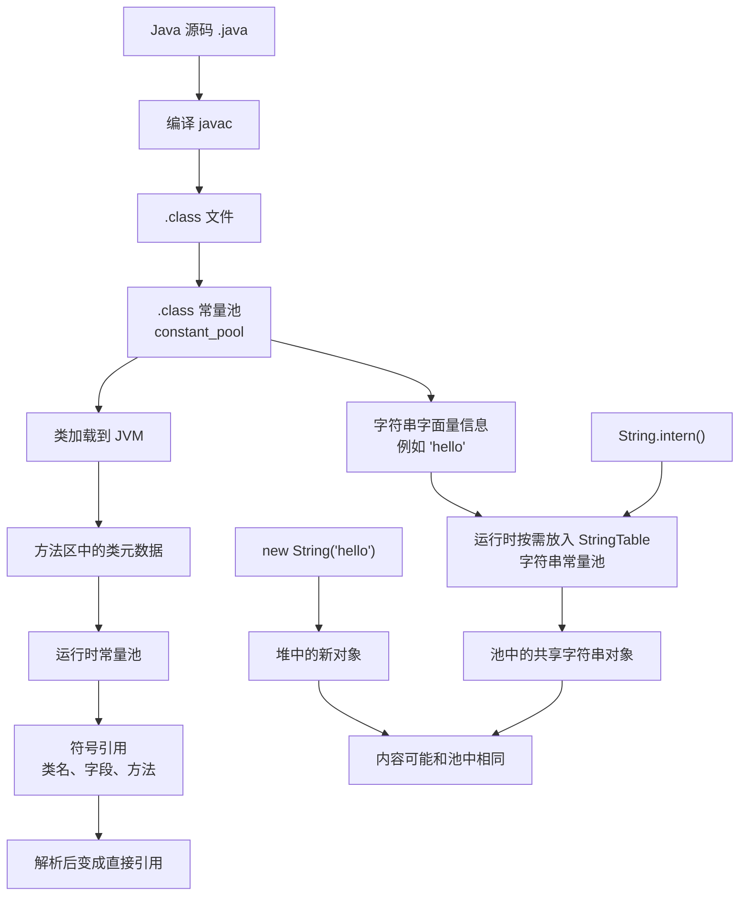

### Java String 知识点清单

###### 内容概述

本文件记录 java基础1 中属于 String 专题的知识点，包括 String 不可变、StringBuffer 和 StringBuilder、常量池、字符串常量池、intern、字符串拼接和不可变底层原因。

###### 使用场景

- Android 中 UI 文案、日志、接口字段、缓存 key 和路由参数都会大量使用字符串。
- 高频字符串拼接、格式化和解析时，需要理解 `StringBuilder`、不可变性和对象创建成本。
- 排查内存、常量池、`==` 和 `equals` 问题时，需要理解字符串常量池和 `intern()`。

一级栏目导航：

- [String](#string)
- [常量池](#常量池)
- [字符串常量池](#字符串常量池)
- [不可变的 3 个底层原因](#不可变的-3-个底层原因)

###### String

String 类是不可改变的，所以你一旦创建了 String 对象，那它的值就无法改变了

原因是str+=”world”开辟了新的内存地址，然后str重新指向了新的地址，旧的地址内容并没有改变。

如果需要对字符串做很多修改，那么应该选择使用 [StringBuffer & StringBuilder 类](https://www.runoob.com/java/java-stringbuffer.html "StringBuffer & StringBuilder 类")。

StringBuffer（多线程） 之间的最大不同在于 StringBuilder 的方法不是线程安全的（不能同步访问），一般情况下StringBuilder（单线程）。。。。创建字符串缓冲区，没超过一定大小的字符串是不是创建新对象的（新内存地址）。

Java 8 及以前常见实现：String 内部主要是 char[]， Java 9+：改成了 byte[] + coder，coder是编码格式，这样做的目的主要是省内存，在 Java 8 里通常每个字符按 2 字节存，Java 9+ 里如果能走 LATIN1（coder），每个字符只要 1 字节

###### 常量池

- **.class 常量池**：编译后类文件里的常量表

每个 .class 文件里都有张 constant_pool 表，它保存的不是只有字符串，还有别的东西：
字符串字面量、数值字面量、类/接口名、字段符号引用、方法符号引用、方法类型、方法句柄、invokedynamic 相关信息。可以把它理解成，编译后的类，把“经常要用到的常量和符号引用”先记在一张表里。

- **运行时常量池**：类加载后 JVM 里的常量表

类加载进 JVM 后，.class 文件里的常量池信息会被加载到 运行时常量池，主要作用是：保存编译期常量池的运行时版本， 把“符号引用”逐步解析成“直接引用”（相当于可以在内存中找到对应编译常量池里面元素的位置）

- **字符串常量池**：JVM 专门给 String 做的共享池

Java 会维护一个专门的字符串共享机制，通常叫 StringTable,它在 HotSpot 的 JDK 6 及以前位于永久代，JDK 7 以后移到堆中，因此不宜笼统表述为“在方法区”。  字符串字面量，以及调用 intern() 后的字符串，会进入这里做复用。除了字符串常量池没有其它专门池

- **IntegerCache 这些**：不是常量池，是缓存机制。比如包装类缓存、编译期常量折叠、static final 常量内联（B类调用A类的常量会出现内联，编译器可能直接把常量写到B类的常量池里）

Java 常量池 / 运行时常量池 / StringTable / 堆 / 栈 的关系图

内存理解图：

Java 中常说的常量池并不是单一的一块内存，而是包含 .class 文件常量池、运行时常量池等概念。它们主要用于保存字面量和符号引用。除此之外，JVM 还对 String 做了专门的复用机制，即字符串常量池（StringTable），用于共享字符串对象、减少重复创建。像 Integer 这类包装类型常见的是缓存机制，而不是通常所说的常量池

###### 字符串常量池

字符串常量池属于JVM内存中的“方法区”（存储类信息、常量、静态变量等），专门存储「字符串常量」—— 即直接用双引号包裹的字符串（如`"a"`、`"abc"`），这些字符串一旦创建，会被池化（复用），避免相同内容的字符串重复创建，造成内存浪费。

规则1：直接赋值的字符串（如`String a = "abc";`），优先存入常量池，自动复用。 - 执行逻辑：JVM先检查常量池是否有“abc” → 无则创建“abc”存入池，再让a指向池中的“abc”；有则直接让a指向池中的“abc”。

规则2：`new String("abc")` 会创建2或者1个(要看常量池里面有没有对象)对象（特殊场景，易踩坑）。 - 执行逻辑：① 检查常量池，若无“abc”，先在常量池创建“abc”（字符串常量）；② 再在堆内存创建一个String对象，这个对象的内容指向常量池中的“abc”；③ 最终变量指向堆内存的对象，而非常量池。

规则3：字符串拼接的结果，是否入池分两种情况： - 纯常量拼接（如`"a" + "b"`）：编译时会直接合并为`"ab"`，存入常量池，复用已有对象； - 含变量拼接（如`a + "b"`，a是变量）：编译时无法确定结果，会在堆内存创建新对象，不会存入常量池，也不复用，如果变量a也是常量，可能还是会直接常量拼接不创建对象

String.intern()方法（手动将string非常量对象入池）

###### 不可变的 3 个底层原因

不可变的3个底层原因（String类的底层是用「final修饰的char数组」存储字符串内容，结合final的特性，实现不可变。【Java 8 及以前，String 底层常见是 char[]；Java 9+ 为了节省内存，引入了 Compact String，改为 byte[] + coder，节省内存了，前者占2个字节，后者占1个字节，在 LATIN1 和 UTF16 之间切换。字符串常量池通常指 StringTable，它在 HotSpot 的 JDK 6 及以前位于永久代，JDK 7 以后移到堆中，因此不宜笼统表述为“在方法区”。】）：

1. char数组用final修饰：final修饰的数组，其「引用地址不可变」—— 即value数组一旦创建，不能再指向其他数组（比如不能再赋值为new char\[10]）。
2. char数组是private的：String类没有提供任何修改value数组内容的方法（如set、modify等），外部无法直接操作数组中的元素（比如不能直接修改value\[0]的值）。
3. String类的方法均不修改原对象：String的所有方法（如substring、replace、concat），看似是“修改”字符串，实则都是创建一个新的String对象，修改新对象的char数组，原对象的char数组始终不变。
   ==不可变目的：配合字符串常量池，实现复用、保证安全==

基本数据类型的字面量（非对象）会出现在 class 文件常量池中，但 Java 并没有像字符串常量池那样，为每种基本类型都单独维护一个常说的“运行时常量池”。

真正容易和常量池混淆的是包装类缓存机制（缓存的是对象，只是指定范围对象都去缓存池里拿，可能就拿到同一个对象）。例如 Integer.valueOf(100) 会复用 IntegerCache 中的对象（默认范围通常是 -128 到 127），Character.valueOf('A') 也会复用 Character 的缓存对象。这些属于缓存，不通常称为常量池。

字符串常量池里复用的是 String 对象；基本类型在运行时保存的是原始值，不是对象。

基本类型字面量可能出现在 class 常量池或字节码里，但这不等于它们变成了对象。

包装类缓存缓存的是对象引用，对象内部对应某个值；不是把包装类直接降成基本类型值来缓存。比如a,b 都是Integer.valueOf(100)，因为刚好命中缓存，a和b引用其实指向的同一个对象，所以a和b相等，如果在缓存范围外的话就不用包装类内的缓存了，就a和b的指向对象不同了
