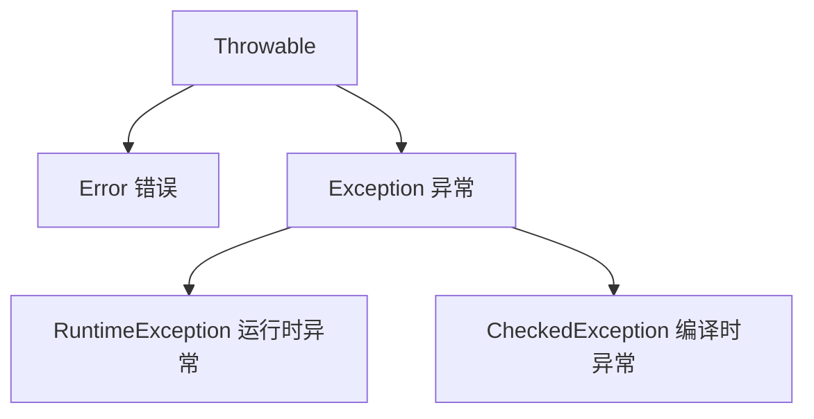

### Java 异常知识点清单

###### 内容概述

本文件记录 java基础1 中属于异常专题的知识点，包括 Throwable 体系、try-catch-finally、throw、throws、异常链化、线程异常独立性和 try-with-resources。

###### 使用场景

- Android 中网络、文件、数据库、权限和解析失败都需要合理处理异常。
- `try-with-resources` 常用于 IO、Cursor、数据库连接等资源释放场景。
- 自定义异常和异常链有助于表达业务失败原因，便于上报和排查。
- 理解线程异常独立性有助于处理后台任务崩溃和全局异常捕获。

一级栏目导航：

- [Exception](#exception)
- [1. 捕获异常（try-catch-finally）](#1.-捕获异常（try-catch-finally）)
- [三个关于finally的不寻常的案例](#三个关于finally的不寻常的案例)
- [2. 抛出异常（throws/throw）](#2.-抛出异常（throws/throw）)
- [try-with-resources](#try-with-resources)

<a id="exception"></a>
###### Exception

Java 中所有异常都继承自 `Throwable` 类，核心分为两大分支：



| 类型                      | 说明                                                                                     | 常见示例                                                                                    | 处理方式                         |
|:-----------------------:|:--------------------------------------------------------------------------------------:|:---------------------------------------------------------------------------------------:|:----------------------------:|
| Error（错误）               | JVM 层面的严重问题，程序无法处理，会直接导致程序崩溃，更偏 JVM、自身运行环境、系统级失败，比如内存耗尽、类加载损坏。它表达的是：应用通常不具备可靠恢复能力，非检查型 | OutOfMemoryError（内存溢出）、StackOverflowError（栈溢出）                                          | 无法处理，只能通过优化代码 / 配置避免         |
| RuntimeException（运行时异常） | 程序逻辑错误导致，编译时不强制处理，运行时才会暴露，非检查型                                                         | NullPointerException（空指针）、ArrayIndexOutOfBoundsException（数组越界）、ArithmeticException（除 0） | 编码时规避（如判空、校验索引），也可捕获处理       |
| CheckedException（编译时异常） | 程序外部因素导致（如文件找不到、网络中断），编译时必须处理，否则报错，检查型                                                 | IOException（IO 异常）、SQLException（数据库异常）、ClassNotFoundException                           | 必须用 try-catch 捕获 或 throws 抛出 |

Java 处理异常的核心是 **捕获（try-catch）** 和 **抛出（throws/throw）**，优先掌握 try-catch 即可。

Exception 更偏应用层、业务层、IO 层，表达的是：这类失败在程序设计上可以预期，也可能被处理

<a id="1.-捕获异常（try-catch-finally）"></a>
###### 1. 捕获异常（try-catch-finally）

不管异不异常finally都会执行，在try块中打开资源，在finally块中清理释放这些资源，try块中的局部变量和catch块中的局部变量（包括异常变量），以及finally中的局部变量，他们之间不可共享使用

一个catch块用于处理一个异常。异常匹配是按照catch块的顺序从上往下寻找的，只有第一个匹配的catch会得到执行。匹配时，不仅运行精确匹配，也支持父类匹配，因此，如果同一个try块下的==多个catch异常类型有父子关系，应该将子类异常放在前面，父类异常放在后面==，这样保证每个catch块都有存在的意义。

<a id="三个关于finally的不寻常的案例"></a>
###### 三个关于finally的不寻常的案例

finally中的return 会覆盖 try 或者catch中的返回值，因为存放的返回值指向同一个地址

finally中的return会抑制（消灭）前面try或者catch块中的异常

finally中的异常会覆盖（消灭）前面try或者catch中的异常

将尽量将所有的return写在函数的最后面，而不是try ... catch ... finally中。

<a id="2.-抛出异常（throws/throw）"></a>
###### 2. 抛出异常（throws/throw）

* **throws**：声明方法可能抛出的异常，把异常 “甩给调用者处理”，发生在方法本身不知道如何处理这样的异常，或者说让调用者处理更好，调用者需要为可能发生的异常负责

适用于==编译时异常==；java运行

```
// 方法声明处抛出IOException，调用该方法的代码必须处理这个异常
public static void readFile() throws IOException {
    FileReader fr = new FileReader("test.txt");
    fr.read();
}
```

* **throw**：手动抛出具体的异常对象，适用于自定义业务异常（入门了解）；java运行

    public static void checkAge(int age) {
        if (age < 0) {
            // 手动抛出运行时异常
            throw new IllegalArgumentException("年龄不能为负数");
        }
        System.out.println("年龄合法：" + age);
    }

**异常链化:**以一个异常对象为参数构造新的异常对象。新的异对象将包含先前异常的信息

注意：为了支持多态，父类方法throws 的是2个异常，子类就不能throws 3个及以上的异常。父类throws IOException，子类就必须throws IOException或者IOException的子类**或者非检查型异常**。重写时 unchecked exception 不受限,但是不能滥用。本质是里氏替换原则，因为如果抛的比较广，那父类引用指向子类对象时，调用方契约就被破坏了。

Java中的异常是线程独立的，线程的问题应该由线程自己来解决，而不要委托到外部，也不会直接影响到其它线程的执行

<a id="try-with-resources"></a>
###### try-with-resources

**try-with-resources 不只是“自动关闭”，而是“标准化资源释放语义”**
它解决的是传统 try-finally 的几个老问题：

- 关闭代码啰嗦
- 多资源关闭顺序容易写错
- 主异常可能被关闭异常覆盖
- 关闭失败的信息容易丢失

关键点有三个：

1. 资源自动关闭
2. 多资源逆序关闭
3. 主异常优先，关闭异常变成 suppressed

 **suppressed exception 和 cause 不是一回事**：


- cause：表示“这个异常是由另一个异常引起的”
- suppressed：表示“本来有个主异常，清理资源时又出了别的异常，但不想覆盖主异常，所以把后者挂起来”

例如：

- 业务代码抛 A

- close() 又抛 B

- 抛出去的是 A

- B 在 A.getSuppressed() 里

这体现的是异常信息保真策略：  主失败不能丢，但清理阶段的失败也不能静默吞掉

让异常类型本身能表达决策信息：通过对应异常或者异常信息去判断，比如是谁的责任，能不能重试，要不要提示用户，要不要上报等。所以异常设计是设计业务比较重要的一块

总结：checked exception 是显式契约，unchecked exception 是隐式风险；异常类本身不仅是报错工具，更是 API 和业务失败语义的一部分。
