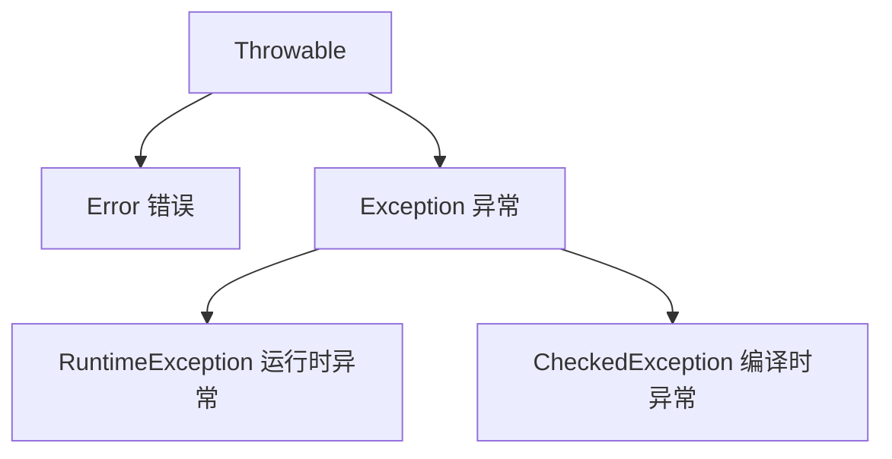

### Java 异常知识点清单

###### 内容概述

本文件记录 异常体系、异常处理、throw 和 throws、finally、资源释放、常见坑、关联面试题 等一级栏目知识点。

一级栏目导航：

- [异常体系](#异常体系)
- [异常处理](#异常处理)
- [throw 和 throws](#throw-和-throws)
- [finally](#finally)
- [资源释放](#资源释放)
- [常见坑](#常见坑)
- [关联面试题](#关联面试题)

###### 异常体系

###### 异常体系的各个点

- `Throwable`。
- `Error`。
- `Exception`。
- `RuntimeException`。
- Checked Exception。
- Unchecked Exception。

###### 面试可能怎么问

- 待补充。

###### 异常处理

###### 异常处理的各个点

- `try`。
- `catch`。
- `finally`。
- catch 子类在前，父类在后。
- 捕获后处理。
- 异常链。

###### 面试可能怎么问

- 待补充。

###### throw 和 throws

###### throw 和 throws的各个点

- `throw` 抛出具体异常对象。
- `throws` 声明方法可能抛出异常。
- checked exception 需要处理或声明。
- unchecked exception 编译期不强制处理。

###### 面试可能怎么问

- 待补充。

###### finally

###### finally的各个点

- finally 通常会执行。
- finally 中 return 会覆盖返回值。
- finally 中异常会覆盖前面的异常。
- 不建议在 finally 中 return。

###### 面试可能怎么问

- 待补充。

###### 资源释放

###### 资源释放的各个点

- 手动关闭资源。
- try-with-resources。
- `AutoCloseable`。
- `close()`。

###### 面试可能怎么问

- 待补充。

###### 常见坑

###### 常见坑的各个点

- 吞异常。
- catch 顺序错误。
- finally 中 return。
- 只打印日志不处理。
- 自定义异常不保留 cause。

###### 面试可能怎么问

- 待补充。

###### 关联面试题

###### 关联面试题的各个点

- [Java 异常体系是什么](../面试/异常面试题.md#java-异常体系是什么)
- [Exception 和 Error 有什么区别](../面试/异常面试题.md#exception-和-error-有什么区别)
- [throw 和 throws 有什么区别](../面试/异常面试题.md#throw-和-throws-有什么区别)
- [finally 中 return 会发生什么](../面试/异常面试题.md#finally-中-return-会发生什么)
- [try-with-resources 解决什么问题](../面试/异常面试题.md#try-with-resources-解决什么问题)

###### 来自 java基础1 的原始整理

> 来源：[java基础1.md](./java基础1.md)

> 说明：以下内容只做归类和简单分点排版，未改写原文表述。

###### Exception

- Java 中所有异常都继承自 `Throwable` 类，核心分为两大分支：



| 类型                      | 说明                                 | 常见示例                                                                                    | 处理方式                         |
|:-----------------------:|:----------------------------------:|:---------------------------------------------------------------------------------------:|:----------------------------:|
| Error（错误）               | JVM 层面的严重问题，程序无法处理，会直接导致程序崩溃       | OutOfMemoryError（内存溢出）、StackOverflowError（栈溢出）                                          | 无法处理，只能通过优化代码 / 配置避免         |
| RuntimeException（运行时异常） | 程序逻辑错误导致，编译时不强制处理，运行时才会暴露          | NullPointerException（空指针）、ArrayIndexOutOfBoundsException（数组越界）、ArithmeticException（除 0） | 编码时规避（如判空、校验索引），也可捕获处理       |
| CheckedException（编译时异常） | 程序外部因素导致（如文件找不到、网络中断），编译时必须处理，否则报错 | IOException（IO 异常）、SQLException（数据库异常）、ClassNotFoundException                           | 必须用 try-catch 捕获 或 throws 抛出 |

- Java 处理异常的核心是 **捕获（try-catch）** 和 **抛出（throws/throw）**，优先掌握 try-catch 即可。

###### 1. 捕获异常（try-catch-finally）

- 不管异不异常finally都会执行，在try块中打开资源，在finally块中清理释放这些资源，try块中的局部变量和catch块中的局部变量（包括异常变量），以及finally中的局部变量，他们之间不可共享使用

- 一个catch块用于处理一个异常。异常匹配是按照catch块的顺序从上往下寻找的，只有第一个匹配的catch会得到执行。匹配时，不仅运行精确匹配，也支持父类匹配，因此，如果同一个try块下的==多个catch异常类型有父子关系，应该将子类异常放在前面，父类异常放在后面==，这样保证每个catch块都有存在的意义。

###### 三个关于finally的不寻常的案例

- finally中的return 会覆盖 try 或者catch中的返回值，因为存放的返回值指向同一个地址

- finally中的return会抑制（消灭）前面try或者catch块中的异常

- finally中的异常会覆盖（消灭）前面try或者catch中的异常

- 将尽量将所有的return写在函数的最后面，而不是try ... catch ... finally中。

2.抛出异常（throws/throw）

- **throws**：声明方法可能抛出的异常，把异常 “甩给调用者处理”，发生在方法本身不知道如何处理这样的异常，或者说让调用者处理更好，调用者需要为可能发生的异常负责

- 适用于==编译时异常==；java运行

```
  // 方法声明处抛出IOException，调用该方法的代码必须处理这个异常
  public static void readFile() throws IOException {
      FileReader fr = new FileReader("test.txt");
      fr.read();
  }
```

- **throw**：手动抛出具体的异常对象，适用于自定义业务异常（入门了解）；java运行

- public static void checkAge(int age) {
- if (age < 0) {
- // 手动抛出运行时异常
- throw new IllegalArgumentException("年龄不能为负数");
- }
- System.out.println("年龄合法：" + age);
- }

- **异常链化:**以一个异常对象为参数构造新的异常对象。新的异对象将包含先前异常的信息

- 注意：为了支持多态，父类方法throws 的是2个异常，子类就不能throws 3个及以上的异常。父类throws IOException，子类就必须throws IOException或者IOException的子类。Java中的异常是线程独立的，线程的问题应该由线程自己来解决，而不要委托到外部，也不会直接影响到其它线程的执行
